## [Online Scientific Calculator](https://www.desmos.com/scientific)

\newpage

## SI Prefixes

| Prefix | Symbol | Value      |
|--------|--------|------------|
| yotta  | Y      | $10^{24}$  |
| zetta  | Z      | $10^{21}$  |
| exa    | E      | $10^{18}$  |
| peta   | P      | $10^{15}$  |
| tera   | T      | $10^{12}$  |
| giga   | G      | $10^{9}$   |
| mega   | M      | $10^{6}$   |
| kilo   | k      | $10^{3}$   |
| hecto  | h      | $10^{2}$   |
| deka   | da     | $10^{1}$   |
| deci   | d      | $10^{-1}$  |
| centi  | c      | $10^{-2}$  |
| milli  | m      | $10^{-3}$  |
| micro  | $\mu$  | $10^{-6}$  |
| nano   | n      | $10^{-9}$  |
| pico   | p      | $10^{-12}$ |
| femto  | f      | $10^{-15}$ |
| atto   | a      | $10^{-18}$ |
| zepto  | z      | $10^{-21}$ |
| yocto  | y      | $10^{-24}$ |

\newpage

## Kinematics (Motion)

### Displacement

$$\Delta x = x_f - x_i$$

|       |                  |
|-------|------------------|
| $x_f$ | final position   |
| $x_i$ | initial position |

>Displacement is a **vector quantity** (See: [Vectors](#vectors)).

### Average Velocity

$$\bar{v} = \frac{\Delta \vec{x}}{\Delta t}$$

|            |                                                                          |
|------------|--------------------------------------------------------------------------|
| $\Delta x$ | Displacement (over the time period) (See: [Displacement](#displacement)) |
| $\Delta t$ | Change in time (See: [Change in Time](#change-in-time))                  |

>Velocity is a **vector quantity**, it measures direction and magnitude.

### Average Acceleration

$$\bar{a} = \frac{\Delta \vec{v}}{\Delta t}$$

|            |                                                                                            |
|------------|--------------------------------------------------------------------------------------------|
| $\Delta v$ | Change in velocity (over the time period) (See: [Change in Velocity](#change-in-velocity)) |
| $\Delta t$ | Change in time (See: [Change in Time](#change-in-time))                                    |

>Acceleration is a **vector quantity**, it measures direction and magnitude.\
>**Note:** Direction of acceleration is not always the same as direction of velocity. (See: [Circular Motion](#circular-motion)).

### Instantaneous Velocity

$$v = \frac{d\vec{x}}{dt}$$

|     |          |
|-----|----------|
| $v$ | velocity |
| $x$ | position |
| $t$ | time     |

> Can ususally be found using equations for constant acceleration (See: [Constant Acceleration](#linear-motion-with-constant-acceleration)).

### Linear Motion with Constant Acceleration

$$v_f = v_i + a\Delta t$$

$$\Delta x = \frac{1}{2}\left(v_i + v_f \right) \Delta t$$

$$\Delta x = v_i\Delta t - \frac{1}{2}a\Delta t^2$$

$$v_f^2 = v_i^2 + 2a\Delta x$$

|            |                                                                          |
|------------|--------------------------------------------------------------------------|
| $v_f$      | final velocity                                                           |
| $v_i$      | initial velocity                                                         |
| $a$        | acceleration                                                             |
| $\Delta t$ | Change in time (See: [Change in Time](#change-in-time))                  |
| $\Delta x$ | Displacement (over the time period) (See: [Displacement](#displacement)) |

>The above equations only work when acceleration is constant

### Projectile Motion

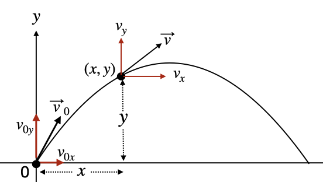

$$x = v_{0x}t = v_{0} t \cos{\theta}$$

$$y = v_{0y}t - \frac{1}{2}gt^2 = v_{0} t \sin{\theta} - \frac{1}{2}gt^2$$

$$v_{0x} = v_0\cos\theta$$

$$v_{0y} = v_0\sin\theta$$

$$v_x = v_{0}\cos{\theta}$$

$$v_y = v_{0}\sin{\theta} - gt$$

$$t_{\text{projectile hits ground}} = \frac{v_0^2}{g}\sin{2\theta}$$

|          |                                         |
|----------|-----------------------------------------|
| $x$      | horizontal position                     |
| $y$      | vertical position                       |
| $v_{0x}$ | initial horizontal velocity             |
| $v_{0y}$ | initial vertical velocity               |
| $v_0$    | initial velocity                        |
| $g$      | acceleration due to gravity (9.8 m/s^2) |
| $t$      | time                                    |

> The equations are all derived from the equations of motion with constant acceleration assuming the following:
>
> - $a_x = 0$
> - $a_y = -g$
>
> They are derived and used by breaking the motion into $x$ (horizontal) and $y$ (vertical) components, solving each as if they were a 1D motion problem, and then combining the results with vector addition (See: [Addition / Subtraction](#addition--subtraction)).

### Free Fall

$$v_f = v_i - gt$$

$$y = v_i t - \frac{1}{2}gt^2$$

$$v_f^2 = v_i^2 - 2gh$$

$$t_{\text{object hits ground}} = \sqrt{\frac{2h}{g}}$$

$$\vec{a} = -g\hat{j} \implies a = g$$

|           |                                 |
|-----------|---------------------------------|
| $v_f$     | final velocity                  |
| $v_i$     | initial velocity                |
| $g$       | acceleration due to gravity     |
| $y$       | vertical position (at time $t$) |
| $h$       | height (initial y position)     |
| $t$       | time                            |
| $\vec{a}$ | acceleration                    |

### Apparent Weight

> If apparent weight is $am$ and mass is $m$ then there is downward acceleration of $(1-a)g$.

### Circular Motion

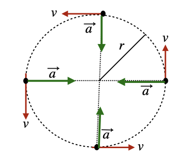

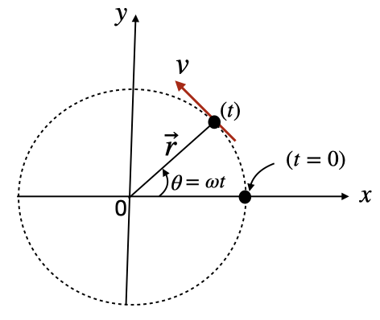

$$\vec{a} = -\omega^2 \vec{r}$$

$$T = \frac{2\pi r}{v}$$

$$\vec{v} = -\omega r \sin{\theta}\hat{i} + \omega r \cos{\theta}\hat{j}$$

$$|\vec{v}| = \omega r$$

$$\vec{r} = r\cos{\theta}\hat{i} + r\sin{\theta}\hat{j}$$

$$\theta = 0 \implies \vec{v} = \omega r \hat{j}$$

$$\theta = \frac{\pi}{2} \implies \vec{v} = -\omega r \hat{i}$$

$$\vec{F}_{\text{net}} = \frac{mv^2}{r}$$

|           |                                          |
|-----------|------------------------------------------|
| $\vec{a}$ | acceleration                             |
| $\vec{r}$ | position                                 |
| $v$       | velocity                                 |
| $r$       | radius                                   |
| $T$       | period (time it takes to go full circle) |
| $\omega$  | constant                                 |
| $\theta$  | angle (relative to the horizontal)       |
| $\hat{i}$ | unit vector in the x direction           |
| $\hat{j}$ | unit vector in the y direction           |

> **Note**: acceleration points in the direction of $-\vec{r}$ (See: [Vectors](#vectors)). Since the magnitude of velocity is constant, the acceleration is only affected by change of direction.

\newpage

## Forces

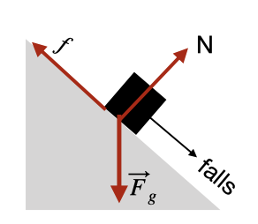

> A force is a **vector quantity** that causes an object to accelerate

### Conservative Forces

$$\oint \vec{F} \cdot d\vec{r} = 0 \implies W_{A \to B} + W_{B \to A} = 0$$

> - A force is **conservative** if the work done by the force on an object moving between two points is independent of the path taken by the object
> - If an object moves in a round trip (i.e. it ends up at the same point it started) then the net work done by a conservative force is zero
>

#### Gravitational Force (weight)

$$\vec{F}_g = mg$$

|             |                                                                                         |
|-------------|-----------------------------------------------------------------------------------------|
| $\vec{F}_g$ | weight                                                                                  |
| $m$         | mass                                                                                    |
| $g$         | acceleration due to gravity, $\left(9.8\frac{m}{s^2} \text{ on Earth's surface}\right)$ |

> - Always vertically downward
> - Gravitational force is **conservative**

### Spring Force

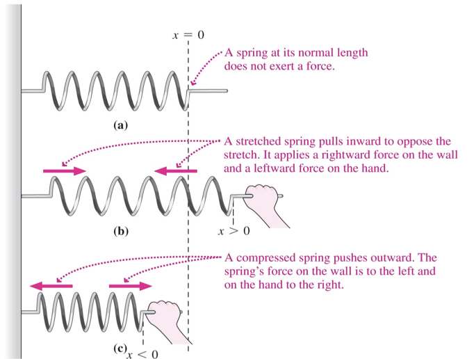

$$F_s = -kx$$

|       |                                           |
|-------|-------------------------------------------|
| $F_s$ | spring force                              |
| $k$   | spring constant (how stiff the spring is) |
| $x$   | displacement from equilibrium position    |

> - *Ideal* spring force is **conservative**
>     - An *ideal* spring is massless and frictionless and doesn't lose energy to heat
>     - Springs we deal with are *ideal* unless otherwise stated

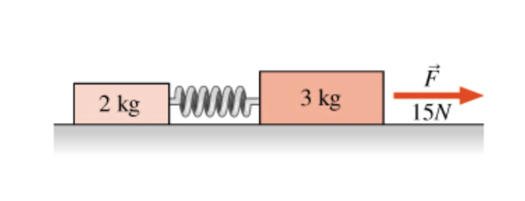

$$\frac{F_s}{m_a} = \frac{F-F_s}{m_b}$$

|       |                                 |
|-------|---------------------------------|
| $F_s$ | spring force                    |
| $F$   | net force exerted on the system |
| $m_a$ | mass of object $A$              |
| $m_b$ | mass of object $B$              |

<!-- TODO: Explain -->

### Non-Conservative Forces

> - A force is **non-conservative** if the work done by the force on an object moving between two points is dependent of the path taken by the object
> - If an object moves in a round trip (i.e. it ends up at the same point it started) then the net work done by a non-conservative force is not zero

#### Friction

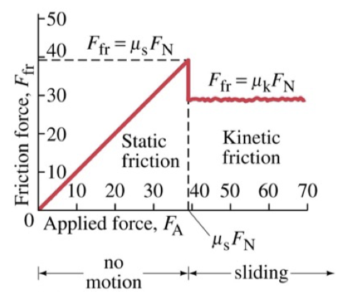

|          |                                 |
|----------|---------------------------------|
| $F_{fr}$ | friction force                  |
| $\mu_s$  | coefficient of static friction  |
| $\mu_k$  | coefficient of kinetic friction |
| $F_N$    | normal force                    |

> - Always parallel to the surface
> - Frictional force is **non-conservative**
> - On a **frictionless** surface, $f = 0$

##### Static Friction

$$\vec{f_s} \leq \mu_s N$$

|           |                                |
|-----------|--------------------------------|
| $f_s$     | static friction force          |
| $\mu_s$   | coefficient of static friction |
| $\vec{N}$ | normal force                   |

##### Kinetic Friction

$$\vec{f} = \mu_k \vec{N}$$

|           |                                 |
|-----------|---------------------------------|
| $\vec{f}$ | friction force                  |
| $\mu_k$   | coefficient of kinetic friction |
| $\vec{N}$ | normal force                    |

#### Normal Force

$$\vec{N} = mg\cos\theta$$

|           |                                                                                         |
|-----------|-----------------------------------------------------------------------------------------|
| $\vec{N}$ | normal force                                                                            |
| $m$       | mass                                                                                    |
| $g$       | acceleration due to gravity, $\left(9.8\frac{m}{s^2} \text{ on Earth's surface}\right)$ |
| $\theta$  | angle of incline (relative to the horizontal)                                           |

> - Represents the force of the surface pushing against the object
> - Always perpendicular to the surface
> - Normal force is **non-conservative**
> - If the object is on an incline, the normal force is less than the weight$^{\dag}$.
> - If the object is on a horizontal surface, the normal force is equal to the weight$^{\dag}$.
> - $^{\dag}$ (See: [Gravitational Force](#gravitational-force-weight)).

#### Tension

> - Represents the force exerted by a string or rope on an object
> - Always parallel to the rope
> - Equal on both sides of the rope
> - Tension is **non-conservative**

### Example

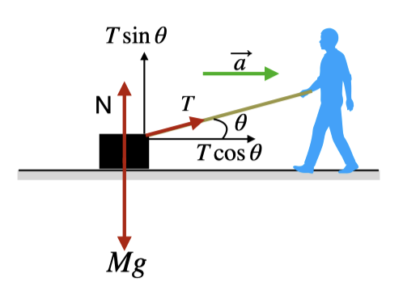

$$\vec{F}_x = T \cos{\theta} = Ma$$

$$\vec{F}_y = N + T \sin{\theta} - Mg = 0$$

|             |                                                                                         |
|-------------|-----------------------------------------------------------------------------------------|
| $\vec{F}_x$ | net force in the x direction                                                            |
| $\vec{F}_y$ | net force in the y direction                                                            |
| $T$         | tension (force from string)                                                             |
| $\theta$    | angle of incline (relative to the horizontal)                                           |
| $M$         | mass of object                                                                          |
| $a$         | acceleration                                                                            |
| $N$         | normal force                                                                            |
| $g$         | acceleration due to gravity, $\left(9.8\frac{m}{s^2} \text{ on Earth's surface}\right)$ |

### String Example

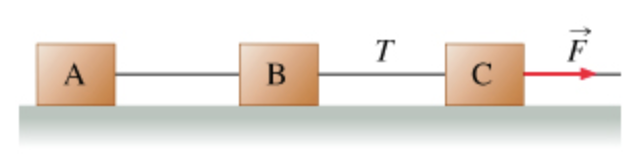

$$\vec{F} = \vec{F}_A + \vec{F}_B + \vec{F}_C$$

$$\vec{F} = (m_A + m_B + m_C)a$$

$$\vec{T} = \vec{F} - \vec{F}_\text{C}$$

|             |                                 |
|-------------|---------------------------------|
| $\vec{F}$   | force (in diagram)              |
| $\vec{T}$   | tension                         |
| $\vec{F}_A$ | net force exerted on object $A$ |
| $\vec{F}_B$ | net force exerted on object $B$ |
| $\vec{F}_C$ | net force exerted on object $C$ |
| $m_A$       | mass of object $A$              |
| $m_B$       | mass of object $B$              |
| $m_C$       | mass of object $C$              |
| $a$         | acceleration                    |

### Newton's Second Law

$$F_{\text{Net}} = ma$$

$$\vec{p} = m\vec{v}$$

|                  |                                                                                                           |
|------------------|-----------------------------------------------------------------------------------------------------------|
| $F_{\text{Net}}$ | the vector sum of all forces acting on the object (See: [Addition / Subtraction](#addition--subtraction)) |
| $m$              | mass                                                                                                      |
| $a$              | acceleration                                                                                              |
| $\vec{p}$        | momentum                                                                                                  |
| $\vec{v}$        | velocity                                                                                                  |

> The equation implies Newton's First Law: $F_{\text{Net}} = 0 \implies a = 0 \implies$ the object is at rest or moving at a constant velocity

\newpage

## Energy

$$E = K + U$$

|     |                  |
|-----|------------------|
| $E$ | energy           |
| $K$ | kinetic energy   |
| $U$ | potential energy |

> SI unit: Joule (J)

### Kinetic Energy

$$K = \frac{1}{2}mv^2$$

|     |                |
|-----|----------------|
| $K$ | kinetic energy |
| $m$ | mass           |
| $v$ | velocity       |

### Potential Energy

$$\Delta U_{A \to B} = -\int_A^B \vec{F} \cdot \vec{dr} = -W_{A \to B}$$

> - Potential energy is the energy of an object due to its position
> - Potential energy is always relative to some reference point
> - Equations can also be used to determine work done by a force.

#### Gravitational Potential Energy

$$U_g = mgh$$

|       |                                |
|-------|--------------------------------|
| $U_g$ | gravitational potential energy |
| $m$   | mass                           |
| $g$   | acceleration due to gravity    |
| $h$   | height                         |

> Stores work done against gravity

#### Elastic Potential Energy

$$U_s = \frac{1}{2}kx^2$$

|       |                               |
|-------|-------------------------------|
| $U_s$ | elastic potential energy      |
| $k$   | spring constant               |
| $x$   | displacement from equilibrium |

> Stores work done in stretching or compressing a spring

### Work

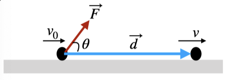

$$W = \int_A^B \vec{F} \cdot \vec{dr}$$

$$W = \vec{F} \cdot \vec{d} = Fd \cos{\theta}$$

$$W = W_c + W_{nc}$$

$$W_{\text{Net}} = \sum W$$

|                  |                                           |
|------------------|-------------------------------------------|
| $W$              | work done by force $\vec{F}$              |
| $\vec{F}$        | force                                     |
| $\vec{d}$        | displacement                              |
| $W_c$            | work done by conservative forces          |
| $W_{nc}$         | work done by non-conservative forces      |
| $d$              | magnitude of displacement                 |
| $W_{\text{Net}}$ | net work done by all forces on the object |

#### Work-Kinetic Energy Theorem

$$W = \Delta K = K_f - K_i$$

|            |                              |
|------------|------------------------------|
| $W$        | work done by force $\vec{F}$ |
| $\Delta K$ | change in kinetic energy     |
| $K_f$      | final kinetic energy         |
| $K_i$      | initial kinetic energy       |

> - Work is a scalar quantity
> - SI unit: Joule (J)

#### Work done by Gravity Example

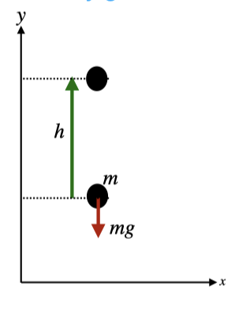

$$W_g = -mgh$$

|       |                             |
|-------|-----------------------------|
| $W_g$ | work done by gravity        |
| $m$   | mass                        |
| $g$   | acceleration due to gravity |
| $h$   | height                      |

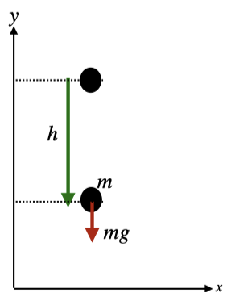

$$W_g = mgh$$

|       |                             |
|-------|-----------------------------|
| $W_g$ | work done by gravity        |
| $m$   | mass                        |
| $g$   | acceleration due to gravity |
| $h$   | height                      |

#### Work done by a Variable Force

$$W = \int_{x_i}^{x_f} F(x)dx$$

|        |                               |
|--------|-------------------------------|
| $W$    | work done by force $F(x)$     |
| $x_i$  | initial position              |
| $x_f$  | final position                |
| $F(x)$ | force at a given position $x$ |

> $F(x)$ is a function of position. The force depends on the position of the object

#### Work done by a Spring

$$W = \int_{x_i}^{x_f} F(x)dx = \int_{x_i}^{x_f} -k x dx = \frac{1}{2}kx_f^2 - \frac{1}{2}kx_i^2 = \frac{1}{2}kx^2$$

$$F(x) = kx$$

|        |                               |
|--------|-------------------------------|
| $W$    | work done by force $F(x)$     |
| $x_i$  | initial position              |
| $x_f$  | final position                |
| $F(x)$ | force at a given position $x$ |
| $k$    | spring constant               |

### Mechanical Energy

$$E_m = K + U$$

|     |                   |
|-----|-------------------|
| $E$ | mechanical energy |
| $K$ | kinetic energy    |
| $U$ | potential energy  |

> SI unit: Joule (J)

#### Conservation of Mechanical Energy

$$W_{nc} = 0 \implies E_{m_i} = E_{m_f}$$

|           |                                       |
|-----------|---------------------------------------|
| $W_{nc}$  | work done by non-conservative forces  |
| $E_{m_i}$ | mechanical energy at initial position |
| $E_{m_f}$ | mechanical energy at final position   |

> - Derived from the work-kinetic energy theorem
> - $W_{nc} = 0$ means that there are no non-conservative forces acting on the object
> - The only non-conserative force is friction
>     - Tension cancels itself out when considering the entire system
>     - Normal force is perpendicular to the displacement, so work done by normal force is 0

### Power

$$P = \frac{W}{\Delta t}$$

$$P = \vec{F} \cdot \vec{v} \text{ (if force is constant)}$$

|            |                |
|------------|----------------|
| $P$        | power          |
| $W$        | work           |
| $\Delta t$ | change in time |
| $\vec{F}$  | force          |
| $\vec{v}$  | velocity       |

> - SI unit: Watt (W)
> - $1 \text{ W} = 1 \text{ J/s}$

### Momentum

$$\vec{p} = m\vec{v}$$

|           |          |
|-----------|----------|
| $\vec{p}$ | momentum |
| $m$       | mass     |
| $\vec{v}$ | velocity |

\newpage

## Newton's Law of Universal Gravitation

$$F_g = G \frac{m_1 m_2}{r^2}$$

|       |                                                                            |
|-------|----------------------------------------------------------------------------|
| $F_g$ | force of gravity                                                           |
| $G$   | gravitational constant $G = 6.67 \times 10^{-11} \text{ Nm}^2/\text{kg}^2$ |
| $m_1$ | mass of object 1                                                           |
| $m_2$ | mass of object 2                                                           |
| $r$   | distance between the two objects                                           |

> - Strictly applied to point masses (particles)
> - Always attractive
> - If one of the masses is the Earth (or similar object), then $r$ is the distance from the center of the Earth to the object

### Gravitational Potential Energy

$$U_g = -G \frac{m_1 m_2}{r}$$

|       |                                                                            |
|-------|----------------------------------------------------------------------------|
| $U_g$ | gravitational potential energy                                             |
| $G$   | gravitational constant $G = 6.67 \times 10^{-11} \text{ Nm}^2/\text{kg}^2$ |
| $m_1$ | mass of object 1                                                           |
| $m_2$ | mass of object 2                                                           |
| $r$   | distance between the two objects                                           |

### Circular Orbits

$$v = \sqrt{\frac{GM}{r}}$$

$$T = \frac{2\pi r}{v}$$

|     |                                                                            |
|-----|----------------------------------------------------------------------------|
| $v$ | tangential velocity of the object                                          |
| $G$ | gravitational constant $G = 6.67 \times 10^{-11} \text{ Nm}^2/\text{kg}^2$ |
| $M$ | mass of the object being orbited                                           |
| $r$ | distance between the two objects                                           |
| $T$ | period of the orbit                                                        |

> The object is orbiting the other object

### Gravitational Field

$$\vec{E} = \frac{\vec{F}}{m}$$

|           |                     |
|-----------|---------------------|
| $\vec{E}$ | gravitational field |
| $\vec{F}$ | gravitational force |
| $m$       | mass of the object  |

### Escape Velocity

$$v_e = \sqrt{\frac{2GM}{r}}$$

|       |                                                                            |
|-------|----------------------------------------------------------------------------|
| $v_e$ | escape velocity                                                            |
| $G$   | gravitational constant $G = 6.67 \times 10^{-11} \text{ Nm}^2/\text{kg}^2$ |
| $M$   | mass of the planet                                                         |
| $r$   | radius of planet                                                           |

\newpage

## Center of Mass

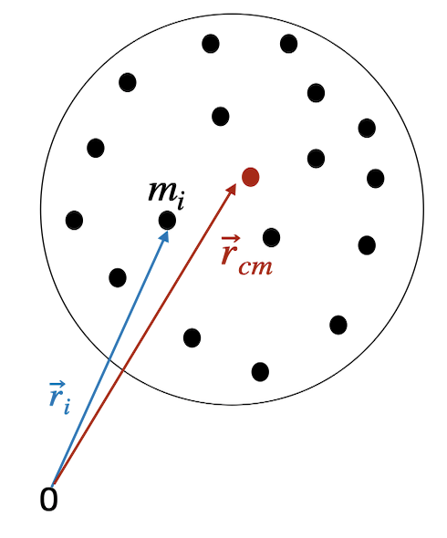

$$\vec{F}_{net} = M \frac{d^2\vec{r}_{cm}}{dt^2} =  M \frac{d\vec{v}_{cm}}{dt} = M \vec{a}_{cm}$$

|                |                                                  |
|----------------|--------------------------------------------------|
| $\vec{F}$      | net force on the system                          |
| $M$            | total mass of the system                         |
| $\vec{r}$      | position of a particle                           |
| $\vec{v}$      | velocity of a particle                           |
| $\vec{a}$      | acceleration of a particle                       |
| $\vec{r}_{cm}$ | position of the center of mass of the system     |
| $\vec{v}_{cm}$ | velocity of the center of mass of the system     |
| $\vec{a}_{cm}$ | acceleration of the center of mass of the system |

> The center of mass is the point where the net force on the system acts

### Discrete distribution of mass

$$\vec{r}_{cm} = \frac{\sum_{i=1}^n m_i \vec{r}_i}{M}$$

$$x_{cm} = \frac{\sum_{i=1}^n m_i x_i}{M}$$

$$y_{cm} = \frac{\sum_{i=1}^n m_i y_i}{M}$$

$$z_{cm} = \frac{\sum_{i=1}^n m_i z_i}{M}$$

|          |                                                    |
|----------|----------------------------------------------------|
| $r_{cm}$ | position of the center of mass of the system       |
| $x_{cm}$ | $x$-coordinate of the center of mass of the system |
| $y_{cm}$ | $y$-coordinate of the center of mass of the system |
| $z_{cm}$ | $z$-coordinate of the center of mass of the system |
| $x_i$    | $x$-coordinate of the $i$th particle               |
| $y_i$    | $y$-coordinate of the $i$th particle               |
| $z_i$    | $z$-coordinate of the $i$th particle               |

### Continuous distribution of mass

$$\vec{r}_{cm} = \lim_{\Delta m \to 0} \frac{\sum_{i=1}^n \Delta m_i \vec{r}_i}{M} = \frac{\int \vec{r} dm}{M}$$

$$x_{cm} = \frac{\int x dm}{M}$$

$$y_{cm} = \frac{\int y dm}{M}$$

$$z_{cm} = \frac{\int z dm}{M}$$

|          |                                                    |
|----------|----------------------------------------------------|
| $r_{cm}$ | position of the center of mass of the system       |
| $x_{cm}$ | $x$-coordinate of the center of mass of the system |
| $y_{cm}$ | $y$-coordinate of the center of mass of the system |
| $z_{cm}$ | $z$-coordinate of the center of mass of the system |
| $x$      | $x$-coordinate of a particle                       |
| $y$      | $y$-coordinate of a particle                       |
| $z$      | $z$-coordinate of a particle                       |
| $dm$     | mass of a particle                                 |

<!-- TODO: explain dm -->

> If the mass is distributed uniformly, then $dm = \rho dV$, where $\rho$ is the density of the object and $dV$ is the volume of the object.

### Total Momentum

$$\vec{p}_{tot} = \sum_{i=1}^n \vec{p}_i = M \vec{v}_{cm}$$

|                 |                              |
|-----------------|------------------------------|
| $\vec{p}$       | momentum of a particle       |
| $\vec{p}_{tot}$ | total momentum of the system |
| $M$             | total mass of the system     |

### Conservation of Linear Momentum

$$\vec{F}_{net} = 0 \implies \vec{p}_{tot} = \text{constant}$$

> If the net external force on a system $(\vec{F}_{net})$ is zero, then $\vec{p}_{tot}$ is constant and the center of mass of the system moves with constant velocity.

### Total Kinetic Energy

$$K_{tot} = \sum_{i=1}^n K_i = \frac{1}{2} M v_{cm}^2$$

|           |                                    |
|-----------|------------------------------------|
| $K$       | kinetic energy of a particle       |
| $K_{tot}$ | total kinetic energy of the system |
| $M$       | total mass of the system           |

\newpage

## Collisions

$$\int_{t_i}^{t_f} \vec{F}(t) dt \approx \vec{F}_{avg} \Delta t$$

|                 |                                                         |
|-----------------|---------------------------------------------------------|
| $t_i$           | start time of the collision                             |
| $t_f$           | end time of the collision                               |
| $\vec{F}$       | force on a particle                                     |
| $\vec{F}_{avg}$ | average force on a particle                             |
| $\Delta t$      | change in time (See: [Change in Time](#change-in-time)) |

### Elastic Collisions

> Elastic collisions are collisions where the total kinetic energy of the system is conserved.

### Inelastic Collisions

> Inelastic collisions are collisions where the total kinetic energy of the system is not conserved.

\newpage

## Rotational Motion

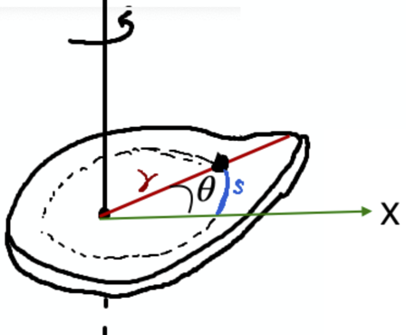

$$s = r \theta$$

$$v_t = r \omega$$

$$a_t = r \alpha$$

$$a_r = \frac{v_t^2}{r} = r \omega^2$$

|          |                                                                                         |
|----------|-----------------------------------------------------------------------------------------|
| $\theta$ | angular displacement of a particle (See: [Angular Displacement](#angular-displacement)) |
| $s$      | arc length of a particle                                                                |
| $r$      | radius of a particle (from the axis of rotation)                                        |
| $v_t$    | tangential velocity of a particle                                                       |
| $\omega$ | angular velocity of a particle (See: [Angular Velocity](#angular-velocity))             |
| $a_t$    | tangential acceleration of a particle                                                   |
| $\alpha$ | angular acceleration of a particle (See: [Angular Acceleration](#angular-acceleration)) |
| $a_r$    | radial (centripetal) acceleration of a particle                                         |

### Right Hand Rule

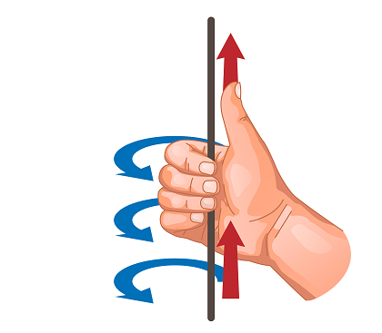

> - Direction of rotation is determined by the position of the thumb
>     - If the thumb points in the direction of the axis of rotation (**typically upward**), then the direction is positive
>     - If the thumb points in the opposite direction of the axis of rotation (**typically downward**), then the direction is negative

### Angular Displacement

$$\Delta \theta = \theta_f - \theta_i$$

|                 |                                |
|-----------------|--------------------------------|
| $\Delta \theta$ | change in angular displacement |
| $\theta_f$      | final angular displacement     |
| $\theta_i$      | initial angular displacement   |

> For Direction (See: [Right Hand Rule](#right-hand-rule))

### Angular Velocity

$$1 \ rpm = \frac{2 \pi}{60} \ rad/s$$

$$1 \ rev/s = 2 \pi \ rad/s$$

> For Direction (See: [Right Hand Rule](#right-hand-rule))
> Measured in Radians per Second ($rad/s$), or Revolutions per Minute/Second ($rpm$ & $rev/s$)

#### Average Angular Velocity

$$\bar{\omega} = \frac{\Delta \theta}{\Delta t}$$

#### Instantaneous Angular Velocity

$$\vec{\omega} = \lim_{\Delta t \to 0} \frac{\Delta \vec{\theta}}{\Delta t} = \frac{d \vec{\theta}}{dt}$$

|                       |                                                         |
|-----------------------|---------------------------------------------------------|
| $\omega$              | angular velocity                                        |
| $\Delta \theta$       | change in angular displacement                          |
| $\Delta t$            | change in time (See: [Change in Time](#change-in-time)) |
| $\frac{d \theta}{dt}$ | derivative of angular displacement with respect to time |

### Angular Acceleration

#### Average Angular Acceleration

$$\bar{\alpha} = \frac{\Delta \vec{\omega}}{\Delta t}$$

#### Instantaneous Angular Acceleration

$$\vec{\alpha} = \lim_{\Delta t \to 0} \frac{\Delta \vec{\omega}}{\Delta t} = \frac{d \vec{\omega}}{dt}$$

|                       |                                                         |
|-----------------------|---------------------------------------------------------|
| $\bar{\alpha}$        | average angular acceleration                            |
| $\vec{\alpha}$        | angular acceleration                                    |
| $\Delta \vec{\omega}$ | change in angular velocity                              |
| $\Delta t$            | change in time (See: [Change in Time](#change-in-time)) |
| $\frac{d \omega}{dt}$ | derivative of angular velocity with respect to time     |

### Rotational Motion with Constant Angular Acceleration

$$\omega_f = \omega_i + \alpha t$$

$$\theta_f = \theta_i + \frac{1}{2} (\omega_i + \omega_f) t$$

$$\theta_f = \theta_i + \omega_i t + \frac{1}{2} \alpha t^2$$

$$\omega_f^2 = \omega_i^2 + 2 \alpha (\theta_f - \theta_i)$$

|            |                              |
|------------|------------------------------|
| $\omega_f$ | final angular velocity       |
| $\omega_i$ | initial angular velocity     |
| $\alpha$   | angular acceleration         |
| $t$        | time                         |
| $\theta_f$ | final angular displacement   |
| $\theta_i$ | initial angular displacement |

> Equations parralel the equations of motion for linear motion (See: [Linear Motion with Constant Acceleration](#linear-motion-with-constant-acceleration))

### Inertia

$$\Iota = m r^2 \implies \text{single-particle system}$$

$$\Iota = \sum_{i=1}^n m_i r_i^2 \implies \text{multi-particle discrete systems}$$

$$\Iota = \int r^2 dm \implies \text{multi-particle continuous systems}$$

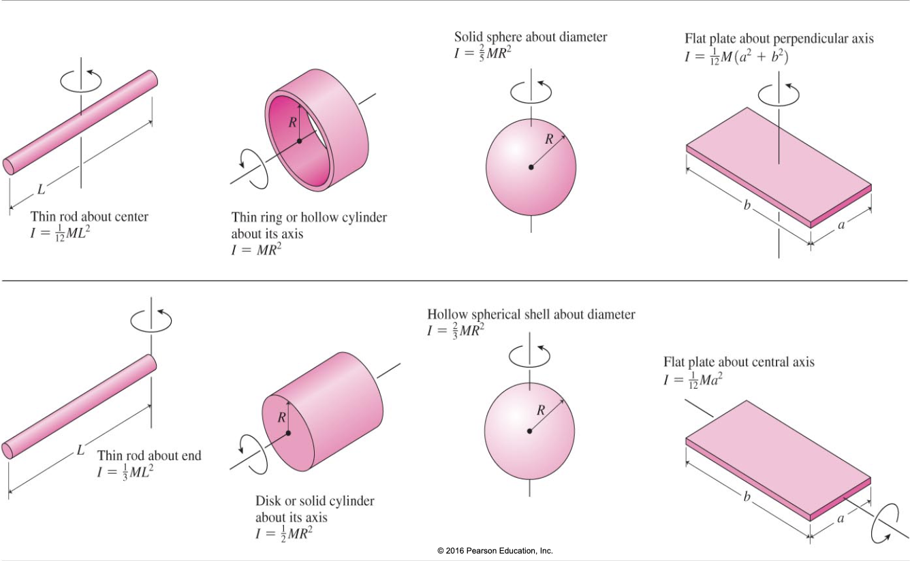

|         |                                                                             |
|---------|-----------------------------------------------------------------------------|
| $\Iota$ | moment of inertia                                                           |
| $m$     | mass                                                                        |
| $n$     | number of particles                                                         |
| $r_i$   | distance from the axis of rotation to the $i$th particle                    |
| $r$     | distance from the axis of rotation to the point of application of the force |
| $dm$    | mass element                                                                |

> - Inertia in rotational motion parrallels mass in linear motion, and is a measure of the resistance of an object to changes in its rotational motion. (higher inertia = harder to rotate)
> - **Note**: Inertia doesn't have a direction, but it does depend on the axis of rotation

#### Parallel Axis Theorem

$$\Iota = \Iota_{cm} + m d^2$$

|              |                                                          |
|--------------|----------------------------------------------------------|
| $\Iota$      | moment of inertia about an axis parallel to $I_{cm}$     |
| $\Iota_{cm}$ | moment of inertia about the center of mass               |
| $m$          | total mass of the system                                 |
| $d$          | distance from the center of mass to the axis of rotation |

### Torque

$$\vec{\tau} = \vec{r} \times \vec{F}$$

$$\tau = r F_{\perp} = r F \sin \theta$$

$$\tau = \Iota \alpha$$

$$\tau = \frac{d \vec{L}}{dt}$$

|                        |                                                                             |
|------------------------|-----------------------------------------------------------------------------|
| $\tau$                 | torque                                                                      |
| $r$                    | distance from the axis of rotation to the point of application of the force |
| $F$                    | magnitude of the force                                                      |
| $\theta$               | angle between the force and the lever arm (radius)                          |
| $\Iota$                | moment of inertia (See: [Inertia](#inertia))                                |
| $\alpha$               | angular acceleration (See: [Angular Acceleration](#angular-acceleration))   |
| $\vec{L}$              | angular momentum (See: [Angular Momentum](#angular-momentum))               |
| $\frac{d \vec{L}}{dt}$ | derivative of angular momentum with respect to time                         |

> - For Direction (See: [Right Hand Rule](#right-hand-rule))
> - $\vec{r} \times \vec{F}$ is the cross product of $\vec{r}$ and $\vec{F}$ (See: [Cross Product](#cross-product))
> - Torque is the rotational equivalent of force

### Rotational Kinetic Energy

$$K = \frac{1}{2} \Iota \omega^2$$

|          |                                                               |
|----------|---------------------------------------------------------------|
| $K$      | rotational kinetic energy                                     |
| $\Iota$  | moment of inertia (See: [Inertia](#inertia))                  |
| $\omega$ | angular velocity (See: [Angular Velocity](#angular-velocity)) |

> Rotational kinetic energy is the energy of an object due to its rotational motion

### Rolling Motion

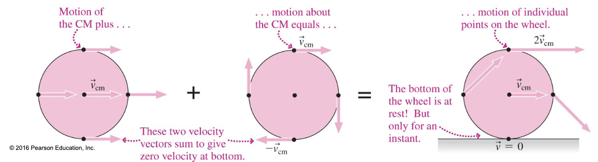

$$v_{cm} = \omega R$$

$$a_{cm} = \alpha R$$

$$\omega = \frac{2 \pi}{\Delta t}$$

|            |                                                                                                 |
|------------|-------------------------------------------------------------------------------------------------|
| $v_{cm}$   | velocity of the center of mass                                                                  |
| $\omega$   | angular velocity (See: [Angular Velocity](#angular-velocity))                                   |
| $R$        | radius of the object                                                                            |
| $\Delta t$ | time it takes for the object to make one full rotation (See: [Change in Time](#change-in-time)) |

> Rolling motion is a combination of translational and rotational motion

#### Kinetic Energy of Rolling Motion

$$K = K_{trans} + K_{rot} \frac{1}{2} m v_{cm}^2 + \frac{1}{2} \Iota \omega^2$$

|             |                                                               |
|-------------|---------------------------------------------------------------|
| $K$         | kinetic energy                                                |
| $K_{trans}$ | translational kinetic energy                                  |
| $K_{rot}$   | rotational kinetic energy                                     |
| $m$         | mass of the system                                            |
| $v_{cm}$    | velocity of the center of mass                                |
| $\Iota$     | moment of inertia (See: [Inertia](#inertia))                  |
| $\omega$    | angular velocity (See: [Angular Velocity](#angular-velocity)) |

> The kinetic energy of an object rolling motion is the sum of the translational and rotational kinetic energies

### Angular Momentum

$$\vec{L} = \vec{r} \times \vec{p}$$

$$\vec{L} = \Iota \vec{\omega}$$

$$\vec{L} = m (\vec{r} \times \vec{v})$$

$$L = m r v \sin \theta$$

|           |                                                                             |
|-----------|-----------------------------------------------------------------------------|
| $\vec{L}$ | angular momentum                                                            |
| $\vec{r}$ | distance from the axis of rotation to the point of application of the force |
| $\vec{p}$ | linear momentum                                                             |
| $\Iota$   | moment of inertia (See: [Inertia](#inertia))                                |
| $\omega$  | angular velocity (See: [Angular Velocity](#angular-velocity))               |
| $m$       | mass                                                                        |
| $\vec{v}$ | velocity                                                                    |
| $\theta$  | angle between the velocity and the lever arm (radius)                       |

> For Direction (See: [Right Hand Rule](#right-hand-rule))

#### Conservation of Angular Momentum

$$\tau_{\text{Net Ext}} = 0 \implies \vec{L}_i = \vec{L}_f$$

|                         |                          |
|-------------------------|--------------------------|
| $\tau_{\text{Net Ext}}$ | net external torque      |
| $\vec{L}_i$             | initial angular momentum |
| $\vec{L}_f$             | final angular momentum   |

> Angular momentum is conserved when the net external torque is zero

\newpage

## Static Equilibrium

$$\sum F_x = 0$$

$$\sum F_y = 0$$

$$\tau_{any} = 0$$

|              |                                |
|--------------|--------------------------------|
| $\sum F$     | sum of the forces              |
| $\tau_{any}$ | torque at any axis of rotation |
| $F_x$        | x-component of the force       |
| $F_y$        | y-component of the force       |
| $\tau$       | torque                         |

> An object is in static equilibrium when it is at rest and the net force and the torque acting at any axis is zero

\newpage

## Simple Harmonic Motion

### Harmonic Motion of a Horizontal Spring

$$\frac{m d^2 x}{dt^2} = -kx$$

$$\frac{d^2 x}{dt^2} = -\omega^2 m$$

$$\omega = \sqrt{\frac{k}{m}}$$

$$T = \frac{2 \pi}{\omega}$$

$$x = A \cos (\omega t + \phi)$$

$$v = -A \omega \sin (\omega t + \phi)$$

$$x(t=0) = A \implies \phi = 0$$

$$x(t=0) = 0 \implies \phi = \frac{\pi}{2}$$

|          |                                                                            |
|----------|----------------------------------------------------------------------------|
| $m$      | mass of the object                                                         |
| $x$      | displacement from equilibrium                                              |
| $k$      | spring constant                                                            |
| $\omega$ | angular frequency (See: [Angular Frequency](#angular-frequency))           |
| $T$      | period (the time it takes for the spring to complete one full oscillation) |
| $A$      | amplitude (maximum displacement from equilibrium)                          |
| $\phi$   | phase constant                                                             |

> The displacement of an object attached to a spring is a sinusoidal function of time

### Harmonic Motion of a Vertical Spring

$$\frac{m d^2 y}{dt^2} = mg - k(\Delta l + y) = mg - k \Delta l - ky$$

$$\frac{d^2 y}{dt^2} = -\omega^2 y$$

$$\omega = \sqrt{\frac{k}{m}}$$

$$T = \frac{2 \pi}{\omega}$$

|            |                                                                            |
|------------|----------------------------------------------------------------------------|
| $m$        | mass of the object                                                         |
| $y$        | displacement from equilibrium                                              |
| $k$        | spring constant                                                            |
| $\omega$   | angular frequency (See: [Angular Frequency](#angular-frequency))           |
| $T$        | period (the time it takes for the spring to complete one full oscillation) |
| $\Delta l$ | change in length of the spring when the object is attached to it           |

### Simple Pendulum

$$T = 2 \pi \sqrt{\frac{l}{g}}$$

|     |                                                                            |
|-----|----------------------------------------------------------------------------|
| $T$ | period (the time it takes for the spring to complete one full oscillation) |
| $l$ | length of the pendulum                                                     |
| $g$ | acceleration due to gravity                                                |

> A simple pendulum is a point mass suspended from a massless string

### Physical Pendulum

$$T = 2 \pi \sqrt{\frac{\Iota}{mgh}}$$

|         |                                                                            |
|---------|----------------------------------------------------------------------------|
| $T$     | period (the time it takes for the spring to complete one full oscillation) |
| $\Iota$ | moment of inertia about the pivot point                                    |
| $m$     | mass of the object                                                         |
| $g$     | acceleration due to gravity                                                |
| $h$     | distance from the pivot point to the center of mass                        |

> A physical pendulum is a rigid body suspended from a pivot point

---
---

\newpage

## Linked Equations

## Vectors

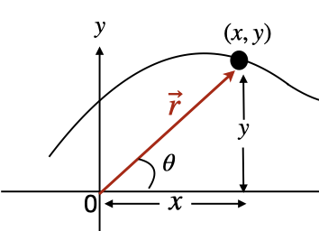

$$\vec{r} = (r, \theta)$$

$$r = |\vec{r}| = \sqrt{r_x^2 + r_y^2}$$

$$\theta = \tan^{-1}\left(\frac{r_y}{r_x}\right)$$

$$r_x = r\cos\theta$$

$$r_y = r\sin\theta$$

|           |                                              |
|-----------|----------------------------------------------|
| $\vec{r}$ | vector                                       |
| $r$       | magnitude (length) of $\vec{r}$              |
| $\theta$  | direction (angle relative to the horizontal) |
| $r_x$     | x-component of $\vec{r}$                     |
| $r_y$     | y-component of $\vec{r}$                     |

> - A vector in general is a quantity that is made up of 2 scalar quantities, magnitude and direction.
> - In physics, vectors are represented by arrows. The length of the arrow represents the magnitude of the vector and the direction of the arrow represents the direction of the vector.
> - The vectors $\vec{r}$ and $-\vec{r}$ have the same magnitude but opposite directions.

### Unit Vectors

$$\hat{r} = \frac{\vec{r}}{|\vec{r}|}$$

$$\vec{r} = r_x \hat{i} \implies \text{1 dimension}$$

$$\vec{r} = r_x \hat{i} + r_y \hat{j} \implies \text{2 dimensions}$$

$$\vec{r} = r_x \hat{i} + r_y \hat{j} + r_z \hat{k} \implies \text{3 dimensions}$$

|           |                          |
|-----------|--------------------------|
| $\hat{r}$ | unit vector of $\vec{r}$ |
| $\vec{r}$ | vector                   |
| $|\vec{r}|$ | magnitude of $\vec{r}$           |
| $r_x$       | x-component of $\vec{r}$         |
| $r_y$       | y-component of $\vec{r}$         |
| $\hat{i}$   | unit vector in the $x$ direction |
| $\hat{j}$   | unit vector in the $y$ direction |
| $\hat{k}$   | unit vector in the $z$ direction |

> - A unit vector of a vector $\vec{r}$ is a vector in the same direction as $\vec{r}$ with a magnitude of 1.
> - In the equations,  $\hat{i}$ and $\hat{j}$ give a direction to $r_x$ and $r_y$ transforming them into vectors.

### Vector Arithmetic

#### Scalar Multiplication

$$a\vec{r} = (ar, \theta)$$

|           |                                                      |
|-----------|------------------------------------------------------|
| $a$       | scalar                                               |
| $\vec{r}$ | vector                                               |
| $r$       | magnitude of $\vec{r}$ (scalar)                      |
| $\theta$  | direction of $a\vec{r}$ (relative to the horizontal) |

> Scalar multiplication of a vector $\vec{r}$ by a scalar $a$ is a vector in the same direction as $\vec{r}$ with a magnitude of $ar$.

#### Addition & Subtraction

$$\vec{A} + \vec{B} = (A_x + B_x)\hat{i} + (A_y + B_y)\hat{j}$$

$$\vec{A} - \vec{B} = (A_x - B_x)\hat{i} + (A_y - B_y)\hat{j}$$

|                      |                                                                            |
|----------------------|----------------------------------------------------------------------------|
| $\vec{A}$, $\vec{B}$ | vectors                                                                    |
| $A_x$, $B_x$         | x-components of $\vec{A}$, $\vec{B}$                                       |
| $A_y$, $B_y$         | y-components of $\vec{A}$, $\vec{B}$                                       |
| $\hat{i}$, $\hat{j}$ | unit vector in the $x$, $y$ direction (See: [Unit Vectors](#unit-vectors)) |

>On a graph, if you connect the vectors $\vec{A}$ and $\vec{B}$ head to tail, the vector from the tail of $\vec{A}$ to the head of $\vec{B}$ is the sum of $\vec{A}$ and $\vec{B}$.

#### Dot Product

$$\vec{A} \cdot \vec{B} = AB \cos{\theta}$$

$$\theta = 0 ° \implies \vec{A} \parallel \vec{B} \implies \vec{A} \cdot \vec{B} = AB$$

$$\theta = 90 ° \implies \vec{A} \perp \vec{B} \implies \vec{A} \cdot \vec{B} = 0$$

$$\theta = 180 ° \implies \vec{A} \parallel \vec{B} \text{ (anti-parallel)} \implies \vec{A} \cdot \vec{B} = -AB$$

|                      |                                                                            |
|----------------------|----------------------------------------------------------------------------|
| $\vec{A}$, $\vec{B}$ | vectors                                                                    |
| $A$, $B$             | magnitudes of $\vec{A}$, $\vec{B}$                                         |
| $\theta$             | angle between $\vec{A}$, $\vec{B}$                                         |
| $\hat{i}$, $\hat{j}$ | unit vector in the $x$, $y$ direction (See: [Unit Vectors](#unit-vectors)) |

> The dot product of two vectors $\vec{A}$ and $\vec{B}$ is a scalar.

## Integration

$$\int_{x_1}^{x_2} x^n dx = \frac{x^{n+1}}{n+1} \Big|_{x_1}^{x_2} = \frac{x_2^{n+1}}{n+1} - \frac{x_1^{n+1}}{n+1}$$

|       |                            |
|-------|----------------------------|
| $x_1$ | lower limit of integration |
| $x_2$ | upper limit of integration |
| $n$   | power of $x$               |

### Change in Time

$$\Delta t = t_f - t_i$$

|       |              |
|-------|--------------|
| $t_f$ | final time   |
| $t_i$ | initial time |

> Usually, $\Delta t$ will just be given as an amount of time, it is sometimes written as $t$.

### Change in Velocity

$$\Delta v = v_f - v_i$$

|       |                  |
|-------|------------------|
| $v_f$ | final velocity   |
| $v_i$ | initial velocity |

> **Note**: $\Delta v$ is a vector quantity, it uses vector subtraction (See: [Addition / Subtraction](#addition--subtraction)).

### Cross Product

$$\vec{A} \times \vec{B} = AB \sin \theta \ \hat{n}$$

$$\hat{j} \times \hat{i} = - \hat{k}$$

$$\hat{k} \times \hat{j} = - \hat{i}$$

$$\hat{i} \times \hat{k} = - \hat{j}$$

|                    |                                                                   |
|--------------------|-------------------------------------------------------------------|
| $\vec{A}, \vec{B}$ | vectors to be multiplied                                          |
| $A, B$             | magnitudes of the vectors                                         |
| $\theta$           | angle between the vectors                                         |
| $\hat{n}$          | unit vector perpendicular to the plane of $\vec{A}$ and $\vec{B}$ |

> For direction of $\hat{n}$ use RHR (See: [Right Hand Rule](#right-hand-rule))
