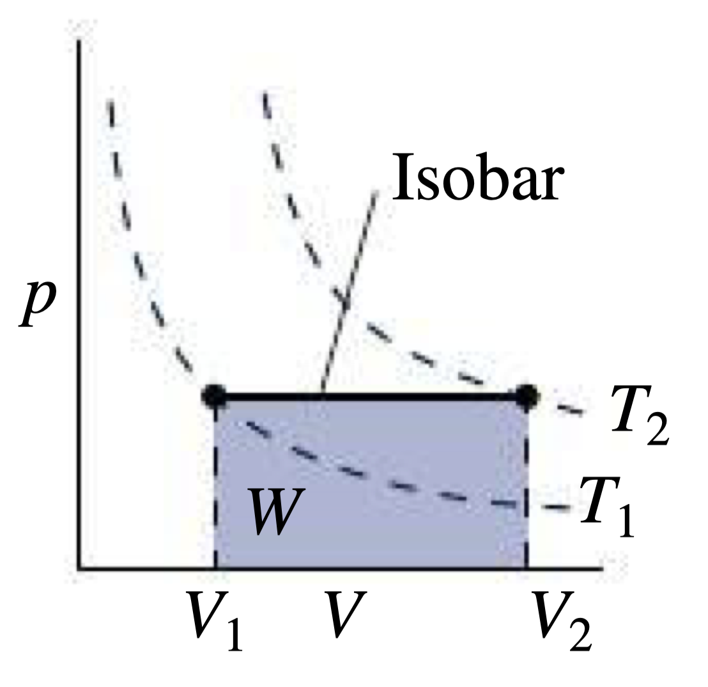

## Miscellaneous

### SI Prefixes

| Prefix | Symbol | Value      |
|--------|--------|------------|
| yotta  | Y      | $10^{24}$  |
| zetta  | Z      | $10^{21}$  |
| exa    | E      | $10^{18}$  |
| peta   | P      | $10^{15}$  |
| tera   | T      | $10^{12}$  |
| giga   | G      | $10^{9}$   |
| mega   | M      | $10^{6}$   |
| kilo   | k      | $10^{3}$   |
| hecto  | h      | $10^{2}$   |
| deka   | da     | $10^{1}$   |
| deci   | d      | $10^{-1}$  |
| centi  | c      | $10^{-2}$  |
| milli  | m      | $10^{-3}$  |
| micro  | $\mu$  | $10^{-6}$  |
| nano   | n      | $10^{-9}$  |
| pico   | p      | $10^{-12}$ |
| femto  | f      | $10^{-15}$ |
| atto   | a      | $10^{-18}$ |
| zepto  | z      | $10^{-21}$ |
| yocto  | y      | $10^{-24}$ |

### Units

$$\mathrm{Pa} = \mathrm{N / m^2}$$

$$\mathrm{W} = \mathrm{J / s} = \mathrm{N \cdot m / s}$$

$$\mathrm{J} = \mathrm{N \cdot m}$$

$$\mathrm{N} = \mathrm{kg \cdot m / s^2}$$

$$\mathrm{V} = \mathrm{J / C}$$

### Unit Conversions

$$\mathrm{1 \ cal = 4.184 \ J}$$

$$\mathrm{\text{\textdegree} F = \frac{9}{5}\text{\textdegree} C + 32}$$

$$\mathrm{K} = \mathrm{\text{\textdegree} C} + 273.15$$

### Vectors

$$\vec{r} = (r, \theta)$$

$$r = |\vec{r}| = \sqrt{r_x^2 + r_y^2}$$

$$\theta = \tan^{-1}\left(\frac{r_y}{r_x}\right)$$

$$r_x = r\cos\theta$$

$$r_y = r\sin\theta$$

|           |                                              |
|-----------|----------------------------------------------|
| $\vec{r}$ | vector                                       |
| $r$       | magnitude (length) of $\vec{r}$              |
| $\theta$  | direction (angle relative to the horizontal) |
| $r_x$     | x-component of $\vec{r}$                     |
| $r_y$     | y-component of $\vec{r}$                     |

> - A vector in general is a quantity that is made up of 2 scalar quantities, magnitude and direction.
> - In physics, vectors are represented by arrows. The length of the arrow represents the magnitude of the vector and the direction of the arrow represents the direction of the vector.
> - The vectors $\vec{r}$ and $-\vec{r}$ have the same magnitude but opposite directions.

#### Unit Vectors

$$\hat{r} = \frac{\vec{r}}{|\vec{r}|}$$

$$\vec{r} = r_x \hat{i} \implies \text{1 dimension}$$

$$\vec{r} = r_x \hat{i} + r_y \hat{j} \implies \text{2 dimensions}$$

$$\vec{r} = r_x \hat{i} + r_y \hat{j} + r_z \hat{k} \implies \text{3 dimensions}$$

|           |                          |
|-----------|--------------------------|
| $\hat{r}$ | unit vector of $\vec{r}$ |
| $\vec{r}$ | vector                   |
| $|\vec{r}|$ | magnitude of $\vec{r}$           |
| $r_x$       | x-component of $\vec{r}$         |
| $r_y$       | y-component of $\vec{r}$         |
| $\hat{i}$   | unit vector in the $x$ direction |
| $\hat{j}$   | unit vector in the $y$ direction |
| $\hat{k}$   | unit vector in the $z$ direction |

> - A unit vector of a vector $\vec{r}$ is a vector in the same direction as $\vec{r}$ with a magnitude of 1.
> - In the equations,  $\hat{i}$ and $\hat{j}$ give a direction to $r_x$ and $r_y$ transforming them into vectors.

#### Vector Arithmetic

##### Scalar Multiplication

$$a\vec{r} = (ar, \theta)$$

|           |                                                      |
|-----------|------------------------------------------------------|
| $a$       | scalar                                               |
| $\vec{r}$ | vector                                               |
| $r$       | magnitude of $\vec{r}$ (scalar)                      |
| $\theta$  | direction of $a\vec{r}$ (relative to the horizontal) |

> Scalar multiplication of a vector $\vec{r}$ by a scalar $a$ is a vector in the same direction as $\vec{r}$ with a magnitude of $ar$.

##### Addition & Subtraction

$$\vec{A} + \vec{B} = (A_x + B_x)\hat{i} + (A_y + B_y)\hat{j}$$

$$\vec{A} - \vec{B} = (A_x - B_x)\hat{i} + (A_y - B_y)\hat{j}$$

|                      |                                                                            |
|----------------------|----------------------------------------------------------------------------|
| $\vec{A}$, $\vec{B}$ | vectors                                                                    |
| $A_x$, $B_x$         | x-components of $\vec{A}$, $\vec{B}$                                       |
| $A_y$, $B_y$         | y-components of $\vec{A}$, $\vec{B}$                                       |
| $\hat{i}$, $\hat{j}$ | unit vector in the $x$, $y$ direction (*See*: [**Unit Vectors**](#unit-vectors)) |

>On a graph, if you connect the vectors $\vec{A}$ and $\vec{B}$ head to tail, the vector from the tail of $\vec{A}$ to the head of $\vec{B}$ is the sum of $\vec{A}$ and $\vec{B}$.

##### Dot Product

$$\vec{A} \cdot \vec{B} = AB \cos{\theta}$$

$$\theta = 0 ° \implies \vec{A} \parallel \vec{B} \implies \vec{A} \cdot \vec{B} = AB$$

$$\theta = 90 ° \implies \vec{A} \perp \vec{B} \implies \vec{A} \cdot \vec{B} = 0$$

$$\theta = 180 ° \implies \vec{A} \parallel \vec{B} \text{ (anti-parallel)} \implies \vec{A} \cdot \vec{B} = -AB$$

|                      |                                                                            |
|----------------------|----------------------------------------------------------------------------|
| $\vec{A}$, $\vec{B}$ | vectors                                                                    |
| $A$, $B$             | magnitudes of $\vec{A}$, $\vec{B}$                                         |
| $\theta$             | angle between $\vec{A}$, $\vec{B}$                                         |
| $\hat{i}$, $\hat{j}$ | unit vector in the $x$, $y$ direction (*See*: [**Unit Vectors**](#unit-vectors)) |

> The dot product of two vectors $\vec{A}$ and $\vec{B}$ is a scalar.

#### Cross Product

$$\vec{A} \times \vec{B} = AB \sin \theta \ \hat{n}$$

$$\hat{j} \times \hat{i} = - \hat{k}$$

$$\hat{k} \times \hat{j} = - \hat{i}$$

$$\hat{i} \times \hat{k} = - \hat{j}$$

|                    |                                                                   |
|--------------------|-------------------------------------------------------------------|
| $\vec{A}, \vec{B}$ | vectors to be multiplied                                          |
| $A, B$             | magnitudes of the vectors                                         |
| $\theta$           | angle between the vectors                                         |
| $\hat{n}$          | unit vector perpendicular to the plane of $\vec{A}$ and $\vec{B}$ |

> For direction of $\hat{n}$ use RHR (*See*: [**Right Hand Rule**](#right-hand-rule)).

#### Right Hand Rule

> - Direction of rotation is determined by the position of the thumb
>     - If the thumb points in the direction of the axis of rotation (**typically upward**), then the direction is positive
>     - If the thumb points in the opposite direction of the axis of rotation (**typically downward**), then the direction is negative

#### Gradient (Vector)

$$\vec{\nabla} = \hat{i} \frac{\partial}{\partial x} + \hat{j} \frac{\partial}{\partial y} + \hat{k} \frac{\partial}{\partial z} \text{ (Cartesian)}$$

$$\vec{\nabla} = \hat{r} \frac{\partial}{\partial r} + \hat{\theta} \frac{1}{r} \frac{\partial}{\partial \theta} + \hat{\phi} \frac{1}{r \sin{\theta}} \frac{\partial}{\partial \phi} \text{ (Spherical)}$$

$$\vec{\nabla} = \hat{r} \frac{\partial}{\partial r} + \hat{\phi} \frac{1}{r} \frac{\partial}{\partial \phi} + \hat{z} \frac{\partial}{\partial z} \text{ (Cylindrical)}$$

> - **Note**: $\partial$ is a partial derivative
>     - $\frac{\partial}{\partial x}$ means take the derivative with respect to $x$ while holding all other variables constant.

### Integration

$$\int_{x_1}^{x_2} x^n dx = \frac{x^{n+1}}{n+1} \Big|_{x_1}^{x_2} = \frac{x_2^{n+1}}{n+1} - \frac{x_1^{n+1}}{n+1}$$

|       |                            |
|-------|----------------------------|
| $x_1$ | lower limit of integration |
| $x_2$ | upper limit of integration |
| $n$   | power of $x$               |

## Thermodynamics

> Motion of heat

### Temperature

> **SI unit**: $\mathrm{K}$ (Kelvin)
>
> Temperature $\neq$ Heat
>
> **Note**: Temperature is a macroscopic property that is a consequence of microscopic motion.

#### Temperature Scales

> *See*: [**Unit Conversions**](#unit-conversions)

|                                                  |                                                                                                                                                |
|--------------------------------------------------|------------------------------------------------------------------------------------------------------------------------------------------------|
| **Celsius** $(\mathrm{\text{\textdegree} C})$    | Water freezes at $0 \mathrm{\text{\textdegree} C}$ and boils at $100 \mathrm{\text{\textdegree} C}$                                            |
| **Fahrenheit** $(\mathrm{\text{\textdegree} F})$ | Human body temperature is $98.6 \mathrm{\text{\textdegree} F}$ If it rises above $100 \mathrm{\text{\textdegree} F}$ it is considered a fever. |
| **Kelvin** $(\mathrm{K})$                        | Absolute zero is $0 \mathrm{K}$                                                                                                                |

### Types of Heat Transfer

- **Conduction**: Heat transfer through direct contact
    - *e.g.* Touching a hot stove
    - *Requires* free electrons (e.g. metals)
- **Convection**: Heat transfer through fluid motion
    - *e.g.* Boiling water, wind, convection oven/air fryer
    - *Requires* fluid motion (e.g. gas/air, liquid/water)
- **Radiation**: Heat transfer through electromagnetic waves
    - *e.g.* Sunlight, microwave, fire
    - *Requires* no medium

### Heat Transfer Rate

> **SI unit**: $\mathrm{W}$ (Watts)
>
> Depends on the type of heat (*See*: [**Types of Heat**](#types-of-heat-transfer))

$$H = \lim_{\Delta t \to 0} \frac{\Delta Q}{\Delta t} = \frac{dQ}{dt}$$

|                 |                                                         |
|-----------------|---------------------------------------------------------|
| $\Delta Q$      | Change in heat (*See*: [**Heat Exchange**](#heat-exchange)) |
| $\Delta t$      | Time interval                                           |
| $\frac{dQ}{dt}$ | Derivative of heat with respect to time                 |

#### Conduction

$$H = k \frac{A}{\Delta x} \Delta T$$

$$\mathcal{R} = \frac{\Delta x}{k} \implies H = \frac{A \Delta T}{\mathcal{R}}$$

$$R = \frac{\mathcal{R}}{A} \implies H = \frac{\Delta T}{R}$$

|               |                                                                          |
|---------------|--------------------------------------------------------------------------|
| $k$           | Thermal conductivity (*See*: [**Table 1**](#table-1-thermal-conductivity-k)) |
| $A$           | Surface Area                                                             |
| $\Delta x$    | Thickness of material                                                    |
| $\Delta T$    | Change in temperature $(T_f - T_i)$                                      |
| $\mathcal{R}$ | R-Factor (Resistance Factor)                                             |
| $R$           | Thermal Resistance                                                       |

##### Table 1: Thermal Conductivity ($k$)

| Material          | $k$ ($\mathrm{W / m \cdot K}$) | $k$ ($\mathrm{Btu \cdot in / h \cdot ft^2 \cdot \text{\textdegree} F}$) |
|-------------------|--------------------------------|-------------------------------------------------------------------------|
| Air               | $0.026$                        | $0.18$                                                                  |
| Aluminum          | $237$                          | $1644$                                                                  |
| Concrete (varies) | $1$                            | $7$                                                                     |
| Copper            | $401$                          | $2780$                                                                  |
| Fiberglass        | $0.042$                        | $0.29$                                                                  |
| Glass             | $0.7 \to 0.9$                  | $5 \to 6$                                                               |
| Goose down        | $0.043$                        | $0.30$                                                                  |
| Helium            | $0.14$                         | $0.97$                                                                  |
| Iron              | $80.4$                         | $558$                                                                   |
| Steel             | $46$                           | $319$                                                                   |
| Styrofoam         | $0.029$                        | $0.20$                                                                  |
| Water             | $0.61$                         | $4.3$                                                                   |
| Wood (pine)       | $0.11$                         | $0.78$                                                                  |

#### Radiation

$$P = e \sigma A T^4$$

|          |                                                                                                          |
|----------|----------------------------------------------------------------------------------------------------------|
| $P$      | Power (*See*: [**Power (Physics 1 Reference)**](/Physics-1_Reference/Markdown/Physics-1_Reference.md#power)) |
| $e$      | Emissivity (between $0$ and $1$)                                                                         |
| $\sigma$ | Stefan-Boltzmann constant ($5.67 \times 10^{-8} \mathrm{W} / \mathrm{m^2 \cdot K^4}$)                    |
| $A$      | Surface area                                                                                             |
| $T$      | Temperature of object (in Kelvin)                                                                        |

### Heat Capacity

> **SI unit**: $\mathrm{J} / \mathrm{K}$ (Joules per Kelvin)

$$C = \frac{\Delta Q}{\Delta T}$$

|            |                                     |
|------------|-------------------------------------|
| $\Delta Q$ | Change in heat                      |
| $\Delta T$ | Change in temperature $(T_f - T_i)$ |

### Specific Heat

> **SI unit**: $\mathrm{J / kg \cdot K}$
>
> Number of joules required to raise the temperature of one kilogram of a substance by one kelvin.

$$c = \frac{C}{m}$$

|     |                                                        |
|-----|--------------------------------------------------------|
| $C$ | Heat capacity (*See*: [**Heat Capacity**](#heat-capacity)) |
| $m$ | Mass                                                   |

#### Table 2: Specific Heat ($c$)

| Substance                                 | $c$ ($\mathrm{J / kg \cdot K}$) |
|-------------------------------------------|---------------------------------|
| Aluminum                                  | $900$                           |
| Concrete                                  | $880$                           |
| Copper                                    | $386$                           |
| Iron                                      | $447$                           |
| Glass                                     | $753$                           |
| Mercury                                   | $140$                           |
| Steel                                     | $502$                           |
| Stone (granite)                           | $840$                           |
| Water                                     | $4184$                          |
| Ice $(-10 \mathrm{\text{\textdegree} C})$ | $2090$                          |
| Wood                                      | $1400$                          |

> Temperature range $0 \to 100 \mathrm{\text{\textdegree} C}$ (unless otherwise specified)

### Heat Exchange

> **SI unit**: $\mathrm{J}$ (Joules)

$$\Delta Q = mc \Delta T$$

|            |                                                        |
|------------|--------------------------------------------------------|
| $m$        | Mass                                                   |
| $c$        | Specific heat (*See*: [**Specific Heat**](#specific-heat)) |
| $\Delta T$ | Change in temperature $(T_f - T_i)$                    |

### Heat Balance

$$\Delta Q_1 + \Delta Q_2 = 0$$

|              |                                                                  |
|--------------|------------------------------------------------------------------|
| $\Delta Q_1$ | Heat change in object 1 (*See*: [**Heat Exchange**](#heat-exchange)) |
| $\Delta Q_2$ | Heat change in object 2 (*See*: [**Heat Exchange**](#heat-exchange)) |

> **Note**: Objects 1 and 2 must be in thermal contact with each other, and thermally isolated from the rest of the universe.

### Heat of Transformation

> **SI unit**: $\mathrm{J}$ (Joules)

{width=75%}

$$Q = mL$$

|     |                                                             |
|-----|-------------------------------------------------------------|
| $Q$ | Heat needed to vaporize/melt $m \mathrm{\ kg}$ of substance |
| $m$ | Mass                                                        |
| $L$ | Latent heat                                                 |

#### Table 3: Latent Heat ($L$)

| Substance       | Melting Point $(\mathrm{K})$ | $L_f$ $(\mathrm{kJ / kg})$ | Boiling Point $(\mathrm{K})$ | $L_v$ $(\mathrm{kJ / kg})$ |
|-----------------|------------------------------|----------------------------|------------------------------|----------------------------|
| Ethyl alcohol   | $159$                        | $109$                      | $351$                        | $879$                      |
| Copper          | $1357$                       | $205$                      | $2840$                       | $4726$                     |
| Lead            | $601$                        | $24.7$                     | $2013$                       | $858$                      |
| Mercury         | $234$                        | $11.3$                     | $630$                        | $296$                      |
| Oxygen          | $54.8$                       | $14.8$                     | $90.2$                       | $213$                      |
| Sulfur          | $388$                        | $53.6$                     | $718$                        | $306$                      |
| Water           | $273.15$                     | $334$                      | $373.15$                     | $2257$                     |
| Uranium dioxide | $3120$                       | $259$                      | $3815$                       | $1533$                     |

### Ideal Gas Law

$$PV = kNT = nRT$$

|     |                                                                        |
|-----|------------------------------------------------------------------------|
| $P$ | Pressure                                                               |
| $V$ | Volume                                                                 |
| $k$ | Boltzmann constant ($1.38 \times 10^{-23} \mathrm{J / K}$)             |
| $N$ | Number of molecules                                                    |
| $n$ | Number of moles ($n = \frac{N}{N_A}$)                                  |
| $R$ | Ideal gas constant ($R = k \cdot N_A = 8.31 \mathrm{J / mol \cdot K}$) |
| $T$ | Temperature                                                            |

> $N_A$ is Avogadro's number ($6.02 \times 10^{23}$)

{#figure-2 width=50%}

](phase_diagram_water.png){width=50%}

> \

### Thermal Expansion

> **SI unit**: $\mathrm{K^{-1}}$ (Kelvin)
>
> Measures how much an object expands when heated

#### Coefficient of *Linear* Expansion

$$\alpha = \frac{\Delta L / L}{\Delta T}$$

|            |                                                                  |
|------------|------------------------------------------------------------------|
| $\alpha$   | Coefficient of linear expansion (*See*: [**Table 4**](#table-4)) |
| $\Delta L$ | Change in length                                                 |
| $L$        | Original length                                                  |
| $\Delta T$ | Change in temperature $(T_f - T_i)$                              |

#### Coefficient of *Volume* Expansion

$$\beta = \frac{\Delta V / V}{\Delta T}$$

|            |                                                                  |
|------------|------------------------------------------------------------------|
| $\beta$    | Coefficient of volume expansion (*See*: [**Table 4**](#table-4)) |
| $\Delta V$ | Change in volume                                                 |
| $V$        | Original volume                                                  |
| $\Delta T$ | Change in temperature $(T_f - T_i)$                              |

#### Table 4: $\alpha$ and $\beta${#table-4}

| Solids      | $\alpha$ $(\mathrm{K^{-1}})$ | Liquids                            | $\beta$ $(\mathrm{K^{-1}})$ |
|-------------|------------------------------|------------------------------------|-----------------------------|
| Aluminum    | $2.4 \times 10^{-5}$         | Air                                | $3.7 \times 10^{-3}$        |
| Brass       | $1.9 \times 10^{-5}$         | Ethyl alcohol                      | $7.5 \times 10^{-4}$        |
| Copper      | $1.7 \times 10^{-5}$         | Gasoline                           | $9.5 \times 10^{-4}$        |
| Pyrex glass | $3.2 \times 10^{-6}$         | Mercury                            | $1.8 \times 10^{-4}$        |
| Ice         | $5.1 \times 10^{-5}$         | Water $(1 \text{\textdegree} C)$   | $-4.8 \times 10^{-5}$       |
| Invar       | $0.9 \times 10^{-6}$         | Water $(20 \text{\textdegree} C)$  | $2.0 \times 10^{-4}$        |
| Steel       | $1.2 \times 10^{-5}$         | Waterm $(50 \text{\textdegree} C)$ | $5.0 \times 10^{-4}$        |

> $\approx$ Room temperatrue  (unless otherwise specified)
>
> Invar is designed to have a very low coefficient of linear expansion

### Temperature and Molecular Kinetic Energy

$$\frac{1}{2} m \bar{v^2} = \frac{3}{2} k T$$

|                           |                                                                                                                                                           |
|---------------------------|-----------------------------------------------------------------------------------------------------------------------------------------------------------|
| $m$                       | Mass                                                                                                                                                      |
| $\bar{v^2}$               | Average squared velocity                                                                                                                                  |
| $k$                       | Boltzmann constant ($1.38 \times 10^{-23} \mathrm{J / K}$)                                                                                                |
| $T$                       | Temperature                                                                                                                                               |
| $\frac{1}{2} m \bar{v^2}$ | Average kinetic energy of a molecule (*See*: [**Kinetic Energy (Physics 1 Reference)**](/Physics-1_Reference/Markdown/Physics-1_Reference.md#kinetic-energy)) |

### Internal Energy

> SI unit: $\mathrm{J}$ (Joules)

#### First Law of Thermodynamics

$$\Delta E_{int} = Q + W$$

|                  |                                                                                                                          |
|------------------|--------------------------------------------------------------------------------------------------------------------------|
| $\Delta E_{int}$ | Change in internal energy                                                                                                |
| $Q$              | Heat transferred to the system (*See*: [**Heat Exchange**](#heat-exchange))                                                  |
| $W$              | Work done on the system (*See*: [**Work (Physics 1 Reference)**](/Physics-1_Reference/Markdown/Physics-1_Reference.md#work)) |

> - Positive Q means a net heat input to the system
> - Negative Q means heat leaves the system
> - Positive W means work is done on the system
> - Negative W means the system does work on its surroundings

#### Work in terms of Pressure and Volume

> **SI unit**: $\mathrm{J}$ (Joules)

$$W = -\int_{V_1}^{V_2} P A dx = -\int_{V_1}^{V_2} P dV$$

$$W = Q_h - Q_c$$

> **Note**: Must be in a closed system.

|       |                                                                                                       |
|-------|-------------------------------------------------------------------------------------------------------|
| $W$   | Work (*See*: [**Work (Physics 1 Reference)**](/Physics-1_Reference/Markdown/Physics-1_Reference.md#work)) |
| $P$   | Pressure                                                                                              |
| $A$   | Area                                                                                                  |
| $V_1$ | Initial volume                                                                                        |
| $V_2$ | Final volume                                                                                          |
| $Q_h$ | Heat added to the system (*See*: [**Heat Exchange**](#heat-exchange))                                     |
| $Q_c$ | Heat removed from the system (*See*: [**Heat Exchange**](#heat-exchange))                                 |

> Work done on the system is negative

#### Isobaric Process

> Constant pressure

{width=50%}

$$P = \text{constant}$$

$$Q = \Delta E_{int} - W = n C_p \Delta T$$

$$W = P \Delta V$$

$$\Delta S_{12} = n C_p \ln{\frac{T_2}{T_1}}$$

|                 |                                                                                                                                        |
|-----------------|----------------------------------------------------------------------------------------------------------------------------------------|
| $W$             | Work (*See*: [**Work (Physics 1 Reference)**](/Physics-1_Reference/Markdown/Physics-1_Reference.md#work))                                  |
| $n$             | Number of moles                                                                                                                        |
| $C_p$, $C_v$    | Molar specific heat at constant pressure/volume (*See*: [**Degrees of Freedom and Specific Heat**](#degrees-of-freedom-and-specific-heat)) |
| $\Delta T$      | Change in temperature $(T_f - T_i)$                                                                                                    |
| $P$             | Pressure                                                                                                                               |
| $\Delta V$      | Change in volume $V_f - V_i$                                                                                                           |
| $R$             | Ideal gas constant ($R = k \cdot N_A = 8.31 \mathrm{J / mol \cdot K}$)                                                                 |
| $m$             | Mass                                                                                                                                   |
| $\Delta S_{12}$ | Change in entropy from state $1$ to state $2$ (*See*: [**Entropy**](#entropy))                                                             |
| $T_1$, $T_2$    | Temperatures at states $1$ and $2$                                                                                                     |

#### Isovolumic Process

> Constant volume

{width=50%}

> Same as isochoric & isometric process

$$V = \text{constant}$$

$$W = 0$$

$$Q = \Delta E_{int} = nC_v \Delta T$$

$$\Delta S_{12} = n C_v \ln{\frac{T_2}{T_1}}$$

|                  |                                                                                                                               |
|------------------|-------------------------------------------------------------------------------------------------------------------------------|
| $W$              | Work (*See*: [**Work (Physics 1 Reference)**](/Physics-1_Reference/Markdown/Physics-1_Reference.md#work))                         |
| $\Delta E_{int}$ | Change in internal energy (*See*: [**Newtons First Law of Thermodynamics**](#first-law-of-thermodynamics))                        |
| $Q$              | Heat (*See*: [**Heat Exchange**](#heat-exchange))                                                                                 |
| $n$              | Number of moles                                                                                                               |
| $C_v$            | Molar specific heat at constant volume (*See*: [**Degrees of Freedom and Specific Heat**](#degrees-of-freedom-and-specific-heat)) |
| $\Delta T$       | Change in temperature $(T_f - T_i)$                                                                                           |
| $\Delta S_{12}$  | Change in entropy from state $1$ to state $2$ (*See*: [**Entropy**](#entropy))                                                    |
| $T_1$, $T_2$     | Temperatures at states $1$ and $2$                                                                                            |

#### Isothermal Process

> Constant temperature

{width=50%}

$$T = \text{constant}$$

$$\Delta E_{int} = 0 \implies Q = -W$$

$$W = -nRT \ln \frac{V_2}{V_1}$$

$$PV = \text{constant}$$

$$\Delta S_{12} = \frac{\Delta Q_{12}}{T}$$

|                  |                                                                                                       |
|------------------|-------------------------------------------------------------------------------------------------------|
| $W$              | Work (*See*: [**Work (Physics 1 Reference)**](/Physics-1_Reference/Markdown/Physics-1_Reference.md#work)) |
| $n$              | Number of moles                                                                                       |
| $R$              | Ideal gas constant ($R = k \cdot N_A = 8.31 \mathrm{J / mol \cdot K}$)                                |
| $T$              | Temperature                                                                                           |
| $V_1$            | Initial volume                                                                                        |
| $V_2$            | Final volume                                                                                          |
| $\Delta E_{int}$ | Change in internal energy (*See*: [**First Law of Thermodynamics**](#first-law-of-thermodynamics))        |
| $Q$              | Heat (*See*: [**Heat Exchange**](#heat-exchange))                                                         |
| $\Delta S_{12}$  | Change in entropy from state $1$ to state $2$ (*See*: [**Entropy**](#entropy))                            |
| $\Delta Q_{12}$  | Change in heat from state $1$ to state $2$ (*See*: [**Heat Exchange**](#heat-exchange))                   |

#### Adiabatic Process

> No heat exchange

{width=50%}

$$Q = 0 \text{ (No heat exchange)}$$

$$\Delta E_{int} = W = \frac{P_2 V_2 - P_1 V_1}{\gamma - 1}$$

$$P V^\gamma = \text{constant}$$

$$T V^{\gamma - 1} = \text{constant}$$

$$\gamma = \frac{C_p}{C_v}$$

$$\Delta S = 0$$

|                  |                                                                                                                                        |
|------------------|----------------------------------------------------------------------------------------------------------------------------------------|
| $W$              | Work (*See*: [**Work (Physics 1 Reference)**](/Physics-1_Reference/Markdown/Physics-1_Reference.md#work))                                  |
| $\Delta E_{int}$ | Change in internal energy (*See*: [**First Law of Thermodynamics**](#first-law-of-thermodynamics))                                         |
| $P_1$            | Initial pressure                                                                                                                       |
| $P_2$            | Final pressure                                                                                                                         |
| $V_1$            | Initial volume                                                                                                                         |
| $V_2$            | Final volume                                                                                                                           |
| $\gamma$         | Ratio of specific heats ($\gamma = \frac{C_p}{C_v}$)                                                                                   |
| $T$              | Temperature                                                                                                                            |
| $C_p$, $C_v$     | Molar specific heat at constant pressure/volume (*See*: [**Degrees of Freedom and Specific Heat**](#degrees-of-freedom-and-specific-heat)) |
| $\Delta S$       | Change in entropy (*See*: [**Entropy**](#entropy))                                                                                         |

#### Degrees of Freedom and Specific Heat

$$C_p = C_v + R$$

> **Note**: The number of **degrees of freedom** is the number of independent ways a molecule can store energy.

#### Monatomic Gas

$$C_v = \frac{3}{2} R$$

$$\gamma = \frac{5}{3}$$

#### Diatomic Gas

$$C_v = \frac{5}{2} R$$

$$\gamma = \frac{7}{5}$$

#### Triatomic Gas

$$C_v = \frac{7}{2} R$$

|          |                                                                                                                                  |
|----------|----------------------------------------------------------------------------------------------------------------------------------|
| $R$      | Ideal gas constant ($R = k \cdot N_A = 8.31 \mathrm{J / mol \cdot K}$)                                                           |
| $C_v$    | Molar specific heat at constant volume                                                                                           |
| $\gamma$ | Ratio of specific heats ($\gamma = \frac{C_p}{C_v}$), used in Adiabatic Process (*See*: [**Adiabatic Process**](#adiabatic-process)) |

### Entropy

> **SI unit**: $\mathrm{J / K}$ (Joules per Kelvin)
>
> - Measure of disorder
> - Systems tend to move towards a state of maximum entropy
> - Higher entropy means more energy is unable to do work

$$\Delta S_{12} = \int_1^2 \frac{dQ}{T}$$

$$E_{\text{unavailable}} = T_{\text{min}} \Delta S$$

|                          |                                                                                     |
|--------------------------|-------------------------------------------------------------------------------------|
| $\Delta S$               | Change in entropy from state $1$ to state $2$                                       |
| $\Delta Q$               | Change in heat from state $1$ to state $2$ (*See*: [**Heat Exchange**](#heat-exchange)) |
| $T$                      | Temperature                                                                         |
| $E_{\text{unavailible}}$ | Energy that becomes unavailable                                                     |
| $T_{\text{min}}$         | Minimum temperature                                                                 |

#### 2nd Law of Thermodynamics

##### Kelvin–Planck statement

It is impossible to construct a heat engine operating in a cycle that extracts heat from a reservoir and delivers an equal amount of work (has 100% efficiency).

##### Clausius statement

It is impossible to construct a device that operates in a cycle and produces no effect other than the transfer of heat from a lower-temperature body to a higher-temperature body.

#### Heat Engines

> **Note**: Heat engines convert heat into work
>

$$e = \frac{W}{Q_h} = 1 - \frac{|Q_c|}{|Q_h|}$$

|       |                                                                                                                                              |
|-------|----------------------------------------------------------------------------------------------------------------------------------------------|
| $e$   | Efficiency                                                                                                                                   |
| $W$   | Work done *by* the engine $(W = Q_h - Q_c)$ (*See*: [**Work (Physics 1 Reference)**](/Physics-1_Reference/Markdown/Physics-1_Reference.md#work)) |
| $Q_h$ | Heat added to the system (*See*: [**Heat Exchange**](#heat-exchange))                                                                            |
| $Q_c$ | Heat removed from the system (*See*: [**Heat Exchange**](#heat-exchange))                                                                        |

##### Carnot Engine

> **Note**: The Carnot engine is the most efficient heat engine possible it has the **Maximum Efficiency** of any heat engine.

{width=75%}

$$e = 1 - \frac{T_c}{T_h}$$

##### Coefficient of Performance

$$\mathrm{COP} = \frac{\text{what we want}}{\text{what we put in}}$$

$$\mathrm{COP_{refrigerator}} = \frac{T_c}{T_h - T_c} = \frac{Q_c}{W} = \frac{Q_c}{Q_h - Q_c}$$

$$\mathrm{COP_{heat \ pump}} = \frac{T_h}{T_h - T_c} = \frac{Q_h}{W} = \frac{Q_h}{Q_h - Q_c}$$

|                |                                                                                                                                              |
|----------------|----------------------------------------------------------------------------------------------------------------------------------------------|
| $\mathrm{COP}$ | Coefficient of performance                                                                                                                   |
| $T_c$          | Temperature of the cold reservoir                                                                                                            |
| $T_h$          | Temperature of the hot reservoir                                                                                                             |
| $Q_h$          | Heat added to the system (*See*: [**Heat Exchange**](#heat-exchange))                                                                            |
| $Q_c$          | Heat removed from the system (*See*: [**Heat Exchange**](#heat-exchange))                                                                        |
| $W$            | Work done *by* the engine $(W = Q_h - Q_c)$ (*See*: [**Work (Physics 1 Reference)**](/Physics-1_Reference/Markdown/Physics-1_Reference.md#work)) |

## Electricity and Magnetism

### Electric Field

> **SI unit**: $\mathrm{N / C}$ (Newtons per Coulomb)

$$\vec{F} = q \vec{E}$$

$$e = -q_e = 1.6 \times 10^{-19} \mathrm{C}$$

$$\vec{E} = \vec{\nabla} V$$

|                |                                                                         |
|----------------|-------------------------------------------------------------------------|
| $\vec{F}$      | Force exerted on $q$ by $\vec{E}$                                       |
| $q$            | Charge                                                                  |
| $\vec{E}$      | Electric field                                                          |
| $e$            | Smallest possible charge                                                |
| $q_e$          | Charge of an electron                                                   |
| $\vec{\nabla}$ | Gradient operator (vector) (See: [**Gradient (Vector)**](#gradient-vector)) |
| $V$            | Electric potential                                                      |

> **Recall**: Newton's Second Law: $\vec{F} = m \vec{a}$
>
> Like charges repel, opposite charges attract.

#### Coulomb's Field (Electric Field of a Point Charge)

$$\vec{E} = \frac{k Q}{r^2} \hat{r}$$

|           |                                                                                                  |
|-----------|--------------------------------------------------------------------------------------------------|
| $\vec{E}$ | Electric field                                                                                   |
| $k$       | Coulomb's constant ($k = \frac{1}{4 \pi \epsilon_0} = 9 \times 10^9 \mathrm{N \cdot m^2 / C^2}$) |
| $Q$       | Charge                                                                                           |
| $r$       | Distance from host charge                                                                        |
| $\hat{r}$ | Radial unit vector (pointing from host charge to test charge)                                    |

> Can also be used for far-field approximation of a dipole or line of charge.

#### Electric Field of a Dipole

> **Dipole**: Two equal and opposite charges separated by a distance $d$

\

$$\vec{E} = -\frac{k p}{r^3} \hat{j}$$

$$r = \sqrt{x^2 + \frac{d^2}{4}}$$

|           |                                                                                                  |
|-----------|--------------------------------------------------------------------------------------------------|
| $\vec{E}$ | Electric field                                                                                   |
| $k$       | Coulomb's constant ($k = \frac{1}{4 \pi \epsilon_0} = 9 \times 10^9 \mathrm{N \cdot m^2 / C^2}$) |
| $p$       | Dipole moment ($p = Q d$)                                                                        |
| $r$       | Distance from each charge in dipole to $P$                                                       |
| $x$       | Distance from dipole to $P$ along the axis of the dipole                                         |
| $d$       | Distance between charges in the dipole                                                           |
| $\hat{j}$ | Unit vector pointing from negative to positive charge                                            |
| $Q$       | Magnitude of each charge in the dipole                                                           |

#### Electric Field of 2 Positive Charges

> Charges have equal magnitude $Q$ and are separated by a distance $d$

\

$$\vec{E} = \frac{2 k Q x}{r^3} \hat{i}$$

$$r = \sqrt{x^2 + \frac{d^2}{4}}$$

|           |                                                                                                  |
|-----------|--------------------------------------------------------------------------------------------------|
| $\vec{E}$ | Electric field at point $P = (x,0)$                                                              |
| $k$       | Coulomb's constant ($k = \frac{1}{4 \pi \epsilon_0} = 9 \times 10^9 \mathrm{N \cdot m^2 / C^2}$) |
| $Q$       | Magnitude of each charge                                                                         |
| $r$       | Distance from each charge to $P$                                                                 |
| $x$       | Distance from charges along the axis to $P$                                                      |
| $d$       | Distance between charges                                                                         |

#### Electric Field of a Line of Charge

> Line is infinite and has even charge density $\lambda$

\

$$\vec{E} = \frac{2 k \lambda}{y} \hat{i}$$

$$\lambda = \frac{dQ}{dx} = \frac{Q}{L} \text{ for line of length } L$$

|           |                                                                                                  |
|-----------|--------------------------------------------------------------------------------------------------|
| $\vec{E}$ | Electric field at point $P = (x,0)$                                                              |
| $k$       | Coulomb's constant ($k = \frac{1}{4 \pi \epsilon_0} = 9 \times 10^9 \mathrm{N \cdot m^2 / C^2}$) |
| $\lambda$ | Charge density                                                                                   |
| $Q$       | Total charge                                                                                     |
| $y$       | Distance from line to $P$                                                                        |

#### Electric Field of a Ring of Charge

> Ring is finite and has even charge density $\lambda$

\

$$\vec{E} = \frac{k Q x}{(x^2 + a^2)^{3/2}} \hat{i}$$

|           |                                                                                                  |
|-----------|--------------------------------------------------------------------------------------------------|
| $\vec{E}$ | Electric field at point $P = (x,0)$                                                              |
| $k$       | Coulomb's constant ($k = \frac{1}{4 \pi \epsilon_0} = 9 \times 10^9 \mathrm{N \cdot m^2 / C^2}$) |
| $Q$       | Total charge                                                                                     |
| $x$       | Distance from ring to $P$                                                                        |
| $a$       | Radius of ring                                                                                   |

### Gauss's Law

#### Electric Flux

> Electric Flux is the amount of electric field passing through a surface (area).

$$\Phi = \oiint \vec{E} \cdot d\vec{A} = \frac{q_{\text{enclosed}}}{\epsilon_0}$$

$$E \parallel A \implies \Phi = EA$$

|                       |                                                                                             |
|-----------------------|---------------------------------------------------------------------------------------------|
| $\Phi$                | Electric flux                                                                               |
| $\oiint$              | Surface integral                                                                            |
| $\vec{E}$             | Electric field                                                                              |
| $d\vec{A}$            | Differential area element                                                                   |
| $q_{\text{enclosed}}$ | Charge enclosed by the surface                                                              |
| $\epsilon_0$          | Permittivity of free space ($\epsilon_0 = 8.85 \times 10^{-12} \mathrm{C^2 / N \cdot m^2}$) |

#### Electric Field Inside/Outside a Spherical Charge Distribution

$$r < a \implies E = \frac{k Q r}{a^3} \text{ (inside)}$$

$$r > a \implies E = \frac{k Q}{r^2} \text{ (outside)}$$

|     |                                                                                                  |
|-----|--------------------------------------------------------------------------------------------------|
| $E$ | Electric field                                                                                   |
| $k$ | Coulomb's constant ($k = \frac{1}{4 \pi \epsilon_0} = 9 \times 10^9 \mathrm{N \cdot m^2 / C^2}$) |
| $Q$ | Total charge                                                                                     |
| $r$ | Distance from center of sphere to $E$                                                            |
| $a$ | Radius of spherical charge distribution                                                          |

### Electric Potential (Voltage)

> **SI unit**: $\mathrm{V}$ (Volts)
>
> In charged conductors, the charge density is generally highest, and the field strongest, where a conductor curves sharply.

$$\Delta V_{AB} = \frac{\Delta U_{AB}}{q} -\int_{A}^{B} \vec{E} \cdot d\vec{r}$$

$$\Delta V_{AB} = - \vec{E} \Delta \vec{r} \text{ (in a uniform field)}$$

$$dV = -\vec{E} \cdot d\vec{r} = -E dr \cos{\theta}$$

|            |                                                           |
|------------|-----------------------------------------------------------|
| $\Delta V$ | Change in electric potential (potential difference)       |
| $\Delta U$ | Change in potential energy                                |
| $q$        | Charge                                                    |
| $\vec{E}$  | Electric field (*See*: [**Electric Field**](#electric-field)) |
| $d\vec{r}$ | Differential displacement element                         |

#### Potential of a Charge Distribution

$$V = k \sum_i \frac{q_i}{r_i} \text{ (Discrete)}$$

$$V = k \int \frac{dq}{r} \text{ (Continuous)}$$

|     |                                                                                                  |
|-----|--------------------------------------------------------------------------------------------------|
| $V$ | Electric potential                                                                               |
| $k$ | Coulomb's constant ($k = \frac{1}{4 \pi \epsilon_0} = 9 \times 10^9 \mathrm{N \cdot m^2 / C^2}$) |
| $q$ | Charge                                                                                           |
| $r$ | Distance from charge to $V$                                                                      |

#### Potential of a Dipole

TODO: Image

TODO: verify & what is $\theta$?
$$V = \frac{k p \cos{\theta}}{r^2}$$

|          |                                                                                                  |
|----------|--------------------------------------------------------------------------------------------------|
| $V$      | Electric potential                                                                               |
| $k$      | Coulomb's constant ($k = \frac{1}{4 \pi \epsilon_0} = 9 \times 10^9 \mathrm{N \cdot m^2 / C^2}$) |
| $p$      | Dipole moment ($p = Q d$)                                                                        |
| $r$      | Distance from dipole to $V$                                                                      |
| $\theta$ | Angle between dipole and $V$                                                                     |

### Capacitors

> For charging/discharging, *see*: [**Capacitor Charging in Circuits**](#capacitor-charging-in-circuits)
>
> Created by 2 plates of area $A$, equal and opposite charge $Q$ separated by a distance $d$

$$\vec{E} = \frac{\sigma}{\epsilon_0} \hat{n}$$

$$\vec{E}_{\text{one plate}} = \frac{\sigma}{2 \epsilon_0} \hat{n}$$

$$\sigma = \frac{Q}{A}$$

|              |                                                                                             |
|--------------|---------------------------------------------------------------------------------------------|
| $\vec{E}$    | Electric field between plates                                                               |
| $\sigma$     | Charge density on each plate                                                                |
| $\epsilon_0$ | Permittivity of free space ($\epsilon_0 = 8.85 \times 10^{-12} \mathrm{C^2 / N \cdot m^2}$) |
| $\hat{n}$    | Unit vector perpendicular to the plates (from positive to negative plate)                   |
| $Q$          | Charge on each plate                                                                        |
| $A$          | Area of each plate                                                                          |

#### Capacitance

> **SI unit**: $\mathrm{F}$ (Farads)

$$C = \frac{Q}{V}$$

$$C = \frac{\epsilon_0 A}{d}$$

|              |                                                                                             |
|--------------|---------------------------------------------------------------------------------------------|
| $C$          | Capacitance                                                                                 |
| $Q$          | Charge (C)                                                                                  |
| $V$          | Potential difference (*See*: [**Electric Potential**](#electric-potential-voltage))             |
| $\epsilon_0$ | Permittivity of free space ($\epsilon_0 = 8.85 \times 10^{-12} \mathrm{C^2 / N \cdot m^2}$) |
| $A$          | Area of each plate                                                                          |
| $d$          | Distance between plates                                                                     |

#### Energy of a Capacitor

$$U = \frac{1}{2} C V^2 = \frac{1}{2} \frac{Q^2}{C}$$

$$U = \int u_E dV = \frac{1}{2} \epsilon_0 \int E^2 dV$$

$$U = \frac{1}{2} \epsilon_0 E^2 \times \text{Volume between plates}$$

$$V = -E d = -\frac{\sigma}{\epsilon_0} d$$

|              |                                                                                             |
|--------------|---------------------------------------------------------------------------------------------|
| $U$          | Energy of a capacitor                                                                       |
| $C$          | Capacitance (*See*: [**Capacitance**](#capacitance))                                            |
| $V$          | Potential difference (*See*: [**Electric Potential**](#electric-potential-voltage))             |
| $u_E$        | Energy density of electric field                                                            |
| $E$          | Electric field between plates (*See*: [**Electric Field**](#electric-field))                    |
| $V$          | Potential difference (*See*: [**Electric Potential**](#electric-potential-voltage))             |
| $\sigma$     | Charge density on each plate (*See*: [**Capacitors**](#capacitors))                             |
| $\epsilon_0$ | Permittivity of free space ($\epsilon_0 = 8.85 \times 10^{-12} \mathrm{C^2 / N \cdot m^2}$) |

#### Capacitors in Series/Parallel

> *See*: [**Series vs Parallel**](#series-vs-parallel) for differences between series and parallel

$$\frac{1}{C_{\text{eq}}} = \sum_i \frac{1}{C_i} \text{ (Series)}$$

$$C_{\text{eq}} = \sum_i C_i \text{ (Parallel)}$$

> $C_{\text{eq}}$: capacitance of capacitor equivalent to the series/parallel combination

#### Dielectrics

> **Dielectric**: Insulating material between the plates of a capacitor

$$C = \kappa C_0$$

$$\epsilon = \kappa \epsilon_0$$

|              |                                                                                             |
|--------------|---------------------------------------------------------------------------------------------|
| $C$          | Capacitance                                                                                 |
| $\kappa$     | Dielectric constant (*See*: [**Table 5**](#table-5-dielectric-constants))                       |
| $C_0$        | Capacitance without dielectric                                                              |
| $\epsilon$   | Permittivity of dielectric material (*See*: [**Table 5**](#table-5-dielectric-constants))       |
| $\epsilon_0$ | Permittivity of free space ($\epsilon_0 = 8.85 \times 10^{-12} \mathrm{C^2 / N \cdot m^2}$) |

#### Table 5: Dielectric Constants

| Material       | $\kappa$ |
|----------------|----------|
| Air            | $1.0006$ |
| Aluminum oxide | $8.4$    |
| Glass (Pyrex)  | $5.6$    |
| Paper          | $3.5$    |
| Plexiglas      | $3.4$    |
| Polyethylene   | $2.3$    |
| Polystyrene    | $2.6$    |
| Quartz         | $3.8$    |
| Tantalum Oxide | $26$     |
| Teflon         | $2.1$    |
| Water          | $80$     |

#### Conductive slab between plates

> Inserting a conductive slab between the plates of a capacitor increases the capacitance the same as if the slab and the area filled by the slab were removed from the capacitor

### Current and Resistance

> - Current: $I$
>     - flow of charge
>     - **SI unit**: $\mathrm{A}$ (Amps)
> - Resistance: $R$
>     - opposition to current
>     - **SI unit**: $\Omega$ (Ohms)

$$I = \frac{\Delta Q}{\Delta t}$$

$$J = \frac{I}{A}$$

|     |                 |
|-----|-----------------|
| $I$ | Current         |
| $Q$ | Charge          |
| $t$ | Time            |
| $J$ | Current density |
| $A$ | Area            |

#### Ohm's Law

$$V = IR$$

$$J = \sigma E = \frac{E}{\rho}$$

$$\sigma = \frac{1}{\rho}$$

$$R \equiv \frac{\rho L}{A}$$

|          |                                                                                 |
|----------|---------------------------------------------------------------------------------|
| $V$      | Potential difference (*See*: [**Electric Potential**](#electric-potential-voltage)) |
| $I$      | Current                                                                         |
| $R$      | Resistance                                                                      |
| $J$      | Current density                                                                 |
| $\sigma$ | Conductivity                                                                    |
| $\rho$   | Resistivity (*See*: [**Table 6**](#table-6-resistivity))                            |
| $E$      | Electric field                                                                  |
| $L$      | Length (of wire)                                                                |
| $A$      | Cross-sectional area (of wire)                                                  |

#### Table 6: Resistivity

| Material                   | Resistivity: $\rho$ ($\Omega \mathrm{\cdot m}$) |
|----------------------------|-------------------------------------------------|
| Metals                     |                                                 |
| Aluminum                   | $2.65 \times 10^{-8}$                           |
| Copper                     | $1.68 \times 10^{-8}$                           |
| Gold                       | $2.24 \times 10^{-8}$                           |
| Iron                       | $9.71 \times 10^{-8}$                           |
| Mercury                    | $9.84 \times 10^{-7}$                           |
| Silver                     | $1.59 \times 10^{-8}$                           |
| Solutions                  |                                                 |
| 1-molar $\mathrm{Cu SO_4}$ | $3.9 \times 10^{-4}$                            |
| 1-molar $\mathrm{HCL}$     | $1.7 \times 10^{-2}$                            |
| 1-molar $\mathrm{NaCl}$    | $1.4 \times 10^{-4}$                            |
| $\mathrm{H_2 O}$           | $2.6 \times 10^5$                               |
| Human Blood                | $0.70$                                          |
| Seawater                   | $0.22$                                          |
| Semiconductors             |                                                 |
| Geranium                   | $0.5$                                           |
| Silicon                    | $3 \times 10^3$                                 |
| Insulators                 |                                                 |
| Ceramic                    | $10^{11} - 10^{14}$                             |
| Glass                      | $10^{10} - 10^{14}$                             |
| Polystyrene                | $10^{15} - 10^{17}$                             |
| Rubber                     | $10^{13} - 10^{16}$                             |
| Wood (dry)                 | $10^{8} - 10^{14}$                              |

#### Drift Velocity

$$I = n q A \vec{v_d} e$$

$$J = n q \vec{v_d} e$$

$$n = \frac{\rho}{m}$$

|             |                                                              |
|-------------|--------------------------------------------------------------|
| $I$         | Current                                                      |
| $n$         | Number of charge carriers (atoms) per unit volume            |
| $q$         | Charge of each atom ($-e = -1.6 \times 10^{-19} \mathrm{C}$) |
| $A$         | Cross-sectional area                                         |
| $J$         | Current density                                              |
| $\vec{v_d}$ | Drift velocity                                               |
| $e$         | Elementary charge ($1.6 \times 10^{-19} \mathrm{C}$)         |
| $\rho$      | mass density                                                 |
| $m$         | Mass of each atom                                            |

#### Power

$$P = IV = I^2 R = \frac{V^2}{R}$$

|     |                                                                          |
|-----|--------------------------------------------------------------------------|
| $P$ | Power (W)                                                                |
| $I$ | Current (A)                                                              |
| $V$ | Potential (V) (*See*: [**Electric Potential**](#electric-potential-voltage)) |
| $R$ | Resistance ($\Omega$)                                                    |

### Circuits

> Current is the same everywhere in a series circuit
>
> [Circuit Simulator](https://www.falstad.com/circuit/circuitjs.html)

#### Voltmeter vs Ammeter

> - Voltmeter: parallel
>     - measures voltage across 2 terminals
>     - ideally has infinite resistance
> - Ammeter: series
>     - measures current through itself
>     - ideally has zero resistance

#### Series vs Parallel

> Series: same current, different voltage
> Parallel: same voltage, different current

#### Resistors in Parallel

> Voltage is the same across each resistor
>
> Current is split between each resistor
>
> Equivalent resistance is less than the smallest resistor

$$I_{p} = \sum_i I_i$$

$$\frac{1}{R_{p}} = \sum_i \frac{1}{R_i}$$

$$I_1 = I \frac{R_2}{R_1 + R_2} \text{ (2 resistors)}$$

$$I_2 = I \frac{R_1}{R_1 + R_2} \text{ (2 resistors)}$$

#### Resistors in Series

> Current is the same across each resistor
>
> Voltage is split between each resistor
>
> Equivalent resistance is the sum of all resistors

$$V_s = \sum_i V_i$$

$$R_s = \sum_i R_i$$

$$V_1 = V \frac{R_1}{R_1 + R_2} \text{ (2 resistors)}$$

$$V_2 = V \frac{R_2}{R_1 + R_2} \text{ (2 resistors)}$$

|                 |                                                                                 |
|-----------------|---------------------------------------------------------------------------------|
| $I$             | Current (*See*: [**Current and Resistance**](#current-and-resistance))              |
| $R$             | Resistance (*See*: [**Current and Resistance**](#current-and-resistance))           |
| $V$             | Potential difference (*See*: [**Electric Potential**](#electric-potential-voltage)) |
| $I_p$           | Total current in parallel circuit                                               |
| $I_i, I_1, I_2$ | Current in each resistor in parallel circuit                                    |
| $R_p, R_s$      | Total resistance in parallel and series circuit (respectively)                  |
| $R_i, R_1, R_2$ | Resistance in each resistor in the circuit                                      |
| $V_s$           | Total voltage in series circuit                                                 |
| $V_i, V_1, V_2$ | Voltage in each resistor in series circuit                                      |

### Kirchoff's Voltage Law

> The sum of all voltages in a closed loop is zero

$$\sum_i V_i = 0 \text{ (closed loop)}$$

> - Draw loops & assign current $(I)$ to each.
> - Find $\sum_i V_i$ for each loop: Start with battery EMF/voltage $(\varepsilon)$, then go around loop subtract voltage drops
> - Voltage drops across resistor $ = IR$
>     - $I = \sum I_i$ (each loop)

### Kirchoff's Current Law

> The sum of all currents entering a node is zero

$$\sum_i I_{in} = \sum I_{out} \text{ (node)}$$

> - Choose nodes & assign voltage $(V)$ to each.
> - Assign current $(I)$ to each branch entering each node
> - Find $\sum_i I_{in}$ incoming current
> - Find $\sum_i I_{out}$ outgoing current is negative

### Capacitor Charging in Circuits

> For in-depth capacitor mechanics, *see*: [**Capacitors**](#capacitors)

#### Initial State $(t = 0)$

> Capacitor acts as a short circuit (no voltage)
>
> Plates have 0 charge

$$q = 0 \implies E = 0 \implies V_c = 0 \text{ (min)}$$

$$I = \frac{\varepsilon}{R} \text{ (max)}$$

#### Intermediate State $(0 < t < \infty)$

> Capacitor charges/discharges
>
> Exponential growth/decay

$$q = Q(1 - e^{-t/z})$$

$$I = \frac{\varepsilon}{R} e^{-t/z}$$

$$V_c = \varepsilon (1 - e^{-t/z})$$

$$z = RC \text{ (time constant)}$$

#### Final State $(t \to \infty)$

> Enough time for capacitor to sufficiently charge
>
> Capacitor is effectively an open circuit (no current)

$$q = Q = CV \implies E = \frac{\sigma}{\epsilon_0} \implies V_c = \varepsilon \text{ (max)}$$

$$I = 0 \text{ (min)}$$

|               |                                                                                                       |
|---------------|-------------------------------------------------------------------------------------------------------|
| $q$           | Charge (*See*: [**Capacitors**](#capacitors))                                                             |
| $Q$           | Maximum charge (*See*: [**Capacitors**](#capacitors))                                                     |
| $C$           | Capacitance (*See*: [**Capacitors**](#capacitors))                                                        |
| $E$           | Electric field (*See*: [**Capacitors**](#capacitors))                                                     |
| $V_c$         | Voltage across capacitor (*See*: [**Capacitors**](#capacitors))                                           |
| $I$           | Current (*See*: [**Current and Resistance**](#current-and-resistance))                                    |
| $R$           | Resistance (*See*: [**Current and Resistance**](#current-and-resistance))                                 |
| $\varepsilon$ | Electromotive force (EMF, same as voltage) (*See*: [**Electric Potential**](#electric-potential-voltage)) |
| $\sigma$      | Surface charge density (*See*: [**Capacitors**](#capacitors))                                             |
| $\epsilon_0$  | Permittivity of free space (*See*: [**Capacitors**](#capacitors))                                         |
| $t$           | Time since circuit closed                                                                             |

### Magnetic Field

> **SI Unit**: Tesla $(T)$
>
> Magnetic field can be generated by current
>
> Direction of current determines the direction of the magnetic field via the right-hand rule

#### Biot-Savart Law

> Magnetic field generated by a current-carrying wire

$$d\vec{B} = \frac{\mu_0 I d\vec{l} \times \hat{r}}{4 \pi r^2}$$

$$\vec{B} = \frac{\mu_0 I}{4 \pi} \int \frac{d\vec{l} \times \hat{r}}{r^2}$$

|            |                                                                 |
|------------|-----------------------------------------------------------------|
| $\vec{B}$  | Magnetic field                                                  |
| $\mu_0$    | Permeability of free space $= 4\pi \times 10^{-7} \frac{Tm}{A}$ |
| $I$        | Current in wire                                                 |
| $d\vec{l}$ | Differential length of wire                                     |
| $\hat{r}$  | Unit vector from wire to point of interest                      |
| $r$        | Distance from wire to point of interest                         |

> Use right-hand rule to determine direction of magnetic field
>
> Magnetic field lines are circles around the wire (azimuthal)
>
> Follows inverse square law

#### Ampere's Law

> - **Requirements**:
>     - $\vec{B}$ is constant along the amperian loop
>     - $\vec{B}$ is tangential to the amperian loop
> - For a straight wire, amperian loop is a centered around the wire

$$\oint \vec{B} \cdot d\vec{l} = \mu_0 I_{\text{encircled}}$$

$$B \cdot L = \mu_0 I_{\text{encircled}}$$

|            |                                                                 |
|------------|-----------------------------------------------------------------|
| $\vec{B}$  | Magnetic field                                                  |
| $\mu_0$    | Permeability of free space $= 4\pi \times 10^{-7} \frac{Tm}{A}$ |
| $I$        | Current in wire                                                 |
| $d\vec{l}$ | Differential length of wire                                     |
| $r$        | Distance from wire to point of interest                         |
| $L$        | Length of amperian loop $= 2 \pi r$                             |

#### Gauss's Law for Magnetism

$$\oint \vec{B} \cdot d\vec{A} = 0$$

|            |                           |
|------------|---------------------------|
| $\vec{B}$  | Magnetic field            |
| $d\vec{A}$ | Differential area element |

#### Magnetic Field of Simple Current Distributions

##### Straight Wire

$$B = \frac{\mu_0 I}{2 \pi r}$$

|         |                                                                 |
|---------|-----------------------------------------------------------------|
| $B$     | Magnetic field at point of interest                             |
| $\mu_0$ | Permeability of free space $= 4\pi \times 10^{-7} \frac{Tm}{A}$ |
| $I$     | Current in wire                                                 |
| $r$     | Distance from wire to point of interest                         |

##### Loop of Wire

{width=75%}

$$\vec{B} = \frac{\mu_0 I r_w^2}{2 r} \hat{i}$$

$$x = 0 \implies \vec{B} = \frac{\mu_0 I}{2 r_w} \hat{i} \text{ (center)}$$

$$x \gg r_w \implies \vec{B} = \frac{\mu_0 I r_w^2}{2 x^3} \hat{i} \text{ (far-field)}$$

$$r = \sqrt{r_w^2 + x^2}$$

|         |                                                                 |
|---------|-----------------------------------------------------------------|
| $B$     | Magnetic field                                                  |
| $\mu_0$ | Permeability of free space $= 4\pi \times 10^{-7} \frac{Tm}{A}$ |
| $I$     | Current in wire                                                 |
| $r_w$   | Radius of wire                                                  |
| $r$     | Distance from wire to point of interest                         |
| $x$     | Distance from center of loop to point of interest               |

##### Sheet (Plane) of Current

$$B = \frac{1}{2} \mu_0 J_s$$

|         |                                                                 |
|---------|-----------------------------------------------------------------|
| $B$     | Magnetic field                                                  |
| $\mu_0$ | Permeability of free space $= 4\pi \times 10^{-7} \frac{Tm}{A}$ |
| $J_s$   | Surface current density                                         |

##### Solenoid (Coil)

$$B = \mu_0 n I$$

|         |                                                                 |
|---------|-----------------------------------------------------------------|
| $B$     | Magnetic field                                                  |
| $\mu_0$ | Permeability of free space $= 4\pi \times 10^{-7} \frac{Tm}{A}$ |
| $n$     | Number of turns per unit length                                 |
| $I$     | Current in wire                                                 |

#### Force of a Magnetic Field on a Moving Charge

$$\vec{F} = q\vec{v} \times \vec{B}$$

|           |                                |
|-----------|--------------------------------|
| $\vec{F}$ | Force on the particle (charge) |
| $q$       | Charge of the particle         |
| $\vec{v}$ | Velocity of the particle       |

#### Cyclotron Motion

$$f = \frac{qB}{2 \pi m}$$

|     |                                          |
|-----|------------------------------------------|
| $f$ | Cyclotron frequency (period of rotation) |
| $q$ | Charge of the particle                   |
| $B$ | Magnetic field                           |
| $m$ | Mass of the particle                     |

> **Note**: $\times$ is the cross product (*See*: [**Cross Product**](../mathematics/cross_product.md))

#### Magnetic Force on a Straight Wire

$$\vec{F} = I\vec{l} \times \vec{B} \text{ (from uniform field)}$$

$$F = \frac{\mu_0 I_1 I_2 l}{2 \pi d} \text{ (from parallel wire)}$$

|            |                                                                 |
|------------|-----------------------------------------------------------------|
| $\vec{F}$  | Force on the particle (charge)                                  |
| $I$        | Current in wire                                                 |
| $\vec{l}$  | Length of wire                                                  |
| $\vec{B}$  | Magnetic field                                                  |
| $d$        | Distance between wires                                          |
| $\mu_0$    | Permeability of free space $= 4\pi \times 10^{-7} \frac{Tm}{A}$ |
| $I_1, I_2$ | Current in each wire                                            |

> Force is attractive if currents are in the same direction, repulsive if in opposite directions
>
> **Note**: $\times$ is the cross product (*See*: [**Cross Product**](#cross-product))

#### Magnetic Flux

> Magnetic flux is the amount of magnetic field passing through a surface (area).

$$\Phi = \oiint \vec{B} \cdot d\vec{A}$$

$$(\vec{B} \perp d\vec{A}) \ \land \ (B \text{ is constant}) \implies \Phi = BA$$

|            |                                                                 |
|------------|-----------------------------------------------------------------|
| $\Phi$     | Magnetic flux                                                   |
| $\oiint$   | Surface integral                                                |
| $\vec{B}$  | Magnetic field                                                  |
| $d\vec{A}$ | Differential area element                                       |

### Induction

> Changing magnetic field induces an electric field

#### Faraday's Law

$$\varepsilon_{\text{induced}} = -\frac{d\phi_B}{dt}$$

> **Recall**: $\varepsilon = \oint \vec{E} \cdot d\vec{l}$ (*See*: [**Electric Potential**](#electric-potential-voltage))

|            |                                                                                             |
|------------|---------------------------------------------------------------------------------------------|
| $\varepsilon_{\text{induced}}$ | Induced electromotive force (EMF, same as voltage) (*See*: [**Electric Potential**](#electric-potential-voltage)) |
| $\frac{d\phi_B}{dt}$ | Rate of change of magnetic flux (*See*: [**Magnetic Flux**](#magnetic-flux)) |

> - RHR for direction of induced current and magnetic field
>     - Determining $\vec{E}$ and $I$ around a loop
>         - Increasing $\vec{B}$: use right hand rule on $-\vec{B}$
>         - Decreasing $\vec{B}$: use right hand rule on $\vec{B}$
> - $\phi_B$ is maximum when $\vec{B} \perp d\vec{A}$
> - $\phi_B$ is $0$ (minimum) when $\vec{B} \parallel d\vec{A}$

#### Magnetic Energy Density

TODO: verify link
> Compare to electric energy density (*See*: [**Capacitors**](#capacitors))
>
> Represents stored energy in magnetic field

$$u_B = \frac{B^2}{2 \mu_0}$$

|     |                                                                                             |
|-----|---------------------------------------------------------------------------------------------|
| $u_B$ | Magnetic energy density                                                                     |
| $B$   | Magnetic field (*See*: [**Magnetic Field**](#magnetic-field))                               |
| $\mu_0$ | Permeability of free space ($\mu_0 = 4\pi \times 10^{-7} \frac{Tm}{A}$) |

#### Inductors

> Solenids encircle their own magnetic flux giving *self-inductance*

$$L \equiv \frac{\Phi}{I} = \frac{NBA}{I} = \mu_0 N^2 \frac{A}{L}$$

$$\Phi = N \phi$$

$$B = \mu_0 n I$$

$$\text{AC} \implies I(t) = I_0 \cos{\omega t}$$

|    |                                                                                             |
|----|---------------------------------------------------------------------------------------------|
| L | Inductance                                                                                  |
| $\Phi$ | Magnetic flux                                                                                |
| $I$ | Current                                                                                     |
| $N$ | Number of turns                                                                              |
| $\phi$ | Magnetic flux per turn                                                                       |
| $B$ | Magnetic field (*See*: [**Magnetic Field**](#magnetic-field))                               |
| $\mu_0$ | Permeability of free space ($\mu_0 = 4\pi \times 10^{-7} \frac{Tm}{A}$) |
| $n$ | Number of turns per unit length $= \frac{N}{L}$                                              |
| $A$ | Cross-sectional area of one loop $A = \pi r^2$                                               |

##### Inductors in Circuits

$$L = \frac{\phi_B}{I} \text{ (self-inductance)}$$

$$I = \frac{\varepsilon_0}{R} (1 - e^{-Rt/L})$$

$$\varepsilon_{\text{induced}} = -L \frac{dI}{dt}$$

|            |                                                                                             |
|------------|---------------------------------------------------------------------------------------------|
| $L$        | Inductance                                                                                  |
| $\phi_B$   | Magnetic flux                                                                                |
| $I$        | Current                                                                                     |
| $\varepsilon_{\text{induced}}$ | Induced electromotive force (EMF, same as voltage) (*See*: [**Electric Potential**](#electric-potential-voltage)) |
| $R$        | Resistance (*See*: [**Current and Resistance**](#current-and-resistance))                   |
| $t$        | Time                                                                                        |

##### Inductor Charging in Circuits

###### Initial State $(t = 0)$

> Inductor is effectively an open circuit (no current)

$$\begin{array}{cccc}
I = 0 \text{ (min)} &&& V = \varepsilon \text{ (max)}
\end{array}$$

###### Intermediate State $(0 < t < \infty)$

> Inductor charges/discharges
>
> Exponential growth/decay

$$\begin{array}{cccc}
I_L (t) = \frac{\varepsilon}{R} (1 - e^{-t / \tau}) &&& V_L (t) = \varepsilon e^{-t / \tau}
\end{array}$$

$$\tau = \frac{L}{R} \text{ (time constant)}$$

###### Final State $(t \to \infty)$

> Enough time for Inductor to sufficiently charge
>
> Inductor acts as a short circuit (no voltage)

$$\begin{array}{cccc}
I = \frac{\varepsilon}{R} \text{ (max)} &&& V = 0 \text{ (min)}
\end{array}$$

|            |                                                                                             |
|------------|---------------------------------------------------------------------------------------------|
| $I$        | Current (*See*: figure above)                                                                                    |
| $V$        | Potential difference (*See*: [**Electric Potential**](#electric-potential-voltage))          |
| $\varepsilon$ | Electromotive force (EMF, same as voltage) (*See*: [**Electric Potential**](#electric-potential-voltage)) |
| $R$        | Resistance (*See*: figure above, and [**Current and Resistance**](#current-and-resistance))                   |

##### Energy Stored in an Inductor

$$U = \frac{1}{2} L I^2$$

|     |                                                                                             |
|-----|---------------------------------------------------------------------------------------------|
| $U$ | Energy stored in an inductor                                                                |
| $L$ | Inductance                                                                                  |
| $I$ | Current                                                                                     |

### Maxwell's Equations

$$\oiint \vec{E} \cdot d\vec{A} = \frac{q_{\text{enclosed}}} {\epsilon_0} \text{ (Gauss's Law)}$$

$$\oiint \vec{B} \cdot d\vec{A} = 0 \text{ (Gauss's Law for Magnetism)}$$

$$\oint_{\text{Amperian Loop}} \vec{B} \cdot d\vec{l} = \mu_0 (I_{\text{encircled}} + I_{\text{displacement}}) \text{ (Modified Ampere's Law)}$$

$$\text{where } I_{\text{displacement}} = \epsilon_0 \frac{d\Phi_E}{dt} = \epsilon_0 \frac{d}{dt} \oiint \vec{E} \cdot d\vec{A} = \epsilon_0 \oiint \frac{\partial \vec{E}}{\partial t} \cdot d\vec{A} \text{ (Displacement Current)}$$

$$\oint \vec{E} \cdot d\vec{l} = -\frac{d\phi_B}{dt} \text{ (Faraday's Law)}$$

|            |                                                                                             |
|------------|---------------------------------------------------------------------------------------------|
| $\vec{E}$  | Electric field                                                                               |
| $\vec{B}$  | Magnetic field                                                                               |
| $d\vec{A}$ | Differential area element                                                                    |

### Electromagnetic Waves

> - Electromagnetic waves are transverse waves
>     - Electric and magnetic fields are perpendicular to eachother and the direction of propagation
> - Electromagnetic waves are self-propagating

#### Speed of Electromagnetic Waves

$$-\frac{\partial B}{\partial x \partial t} = \frac{\partial^2 E}{\partial x^2} = \mu \epsilon \frac{\partial^2 E}{\partial t^2} \implies v = \frac{1}{\sqrt{\mu \epsilon}} = \frac{1}{n}$$

$$\begin{aligned}
\text{vacuum} &\implies & \mu &= mu_0 & \epsilon &= \epsilon_0 & v &= c \\
\text{material} &\implies & \mu &= \mu_r \mu_0 & \epsilon &= \epsilon_r \epsilon_0
\end{aligned}$$

$$E = v B$$

|            |                                                                                             |
|------------|---------------------------------------------------------------------------------------------|
| $v$        | Speed of light (Electromagnetic waves)                                                      |
| $c$        | Speed of light in a vacuum ($c = 3 \times 10^8 \frac{m}{s}$)                                 |
| $\mu$      | Permeability of material                                                                      |
| $\mu_0$    | Permeability of free space ($\mu_0 = 4\pi \times 10^{-7} \frac{Tm}{A}$)                      |
| $\epsilon$ | Permittivity of material                                                                      |
| $\epsilon_0$ | Permittivity of free space ($\epsilon_0 = 8.85 \times 10^{-12} \mathrm{C^2 / N \cdot m^2}$) |
| $E$        | Electric field                                                                                |
| $B$        | Magnetic field                                                                                |
| $n$        | Index of refraction                                                                            |

##### Einstein's Theory of Special Relativity

$c$ is the speed limit of the universe.

#### Frequency and Wavelength

$$v = \lambda f$$

|     |                                                                                             |
|-----|---------------------------------------------------------------------------------------------|
| $v$ | Speed of light (Electromagnetic waves)                                                      |
| $\lambda$ | Wavelength                                                                                   |
| $f$ | Frequency                                                                                    |

#### Intensity

$$S \equiv \frac{P}{\text{Area}} = \frac{P}{4 \pi r^2} = u v$$

$$u = u_E + u_B = \epsilon E^2 + \frac{B^2}{2\mu}$$

$$\vec{S} = \frac{\vec{E} \times \vec{B}}{\mu} \text{ (Poynting vector)}$$

|     |                                                                                             |
|-----|---------------------------------------------------------------------------------------------|
| $S$ | Intensity of electromagnetic wave                                                            |
| $P$ | Power                                                                                       |
| $u$ | Energy density                                                                              |
| $v$ | Speed of electromagnetic wave                                                               |
| $u_E$, $u_B$ | Energy density of electric and magnetic fields respectively (*See*: [**Magnetic Energy Density**](#magnetic-energy-density) & [**Capacitors**](#capacitors)) |
| $E$, $\vec{E}$ | Electric field                                                                               |
| $B$, $\vec{B}$ | Magnetic field                                                                               |
| $\epsilon$ | Permittivity of material                                                                      |
| $\mu$ | Permeability of material                                                                      |
| $r$ | Distance from source of electromagnetic wave                                                  |

#### Polarization

\
{width=50%}\
\

$$S = S_0 \cos^2{\theta}$$

$$E = E_0 \cos{\theta}$$

|     |                                                                                             |
|-----|---------------------------------------------------------------------------------------------|
| $S$ | Intensity of electromagnetic wave after passing through a polarizer                         |
| $S_0$ | Intensity of electromagnetic wave before passing through a polarizer                        |
| $\theta$ | Angle between the polarizer and the direction of polarization                               |
| $E$ | Electric field after passing through a polarizer                                             |
| $E_0$ | Electric field before passing through a polarizer                                            |

#### Radiation Pressure

> **SI Unit**: $\mathrm{Pa}$ (Pascals)

$$P_{\text{rad}} = \frac{\bar{S}}{c}$$

|     |                                                                                             |
|-----|---------------------------------------------------------------------------------------------|
| $P_{\text{rad}}$ | Radiation pressure                            |
| $S$ | Intensity of electromagnetic wave                                                            |
| $c$ | Speed of light in a vacuum ($c = 3 \times 10^8 \frac{m}{s}$)                                 |

### Optics

#### Law of Reflection

$$\theta_i = \theta_r$$

|     |                                                                                             |
|-----|---------------------------------------------------------------------------------------------|
| $\theta_i$ | Angle of incidence (angle from incoming wave to normal) |
| $\theta_r$ | Angle of reflection (angle from reflected wave to normal) |

#### Law of Refraction (Snell's Law)

$$n_1 \sin{\theta_1} = n_2 \sin{\theta_2}$$

|     |                                                                                             |
|-----|---------------------------------------------------------------------------------------------|
| $n_1, n_2$ | Index of refraction of material 1 and 2 respectively |
| $\theta_1$ | Angle of incidence (angle from incoming wave to normal) |
| $\theta_2$ | Angle of refraction (angle from refracted wave to normal) |

#### Total Internal Reflection

> When $\theta_i > \theta_c$, the wave is reflected back into the material\
> Used in fiber optics

$$\sin{\theta_c} = \frac{n_2}{n_1}$$

#### Dispersion

Different colors refract at different angles

#### Image Formation

##### Flat Mirror

\
{width=50%}\
\

##### Curved Mirrors and Lenses

\
{width=75%}\
\

$$M \equiv \frac{h^\prime}{h} = \frac{l^\prime}{l}$$

$$\frac{1}{l} + \frac{1}{l^\prime} = \frac{1}{f} \text{ (Thin Lens \& Mirrors)}$$

$$\frac{n_1}{l} + \frac{n_2}{l^\prime} = \frac{n_2 - n_1}{R} \text{ (Thick Lens, Type I)}$$

$$\frac{1}{l} + \frac{1}{l^\prime} = (n - 1) \left(\frac{1}{R_1} - \frac{1}{R_2} \right) \text{ (Thick Lens, Type II)}$$

|    |                                                                                             |
|----|---------------------------------------------------------------------------------------------|
| $M$ | Magnification factor                                                                        |
| $o, i$ | object and image location respectively |
| $h, h^\prime$ | object and image height respectively |
| $l, l^\prime$ | object and image distance from mirror (center)respectively |
| $F$ | focal point of mirror (point where parallel rays converge) |
| $f$ | focal length (distance from mirror to focal point) |
| $R_1, R_2$ | radii of curvature of mirror (positive for concave, negative for convex) |
| $n_1, n_2$ | indices of refraction of outside and inside the lens respectively |

- **Sign Convention**:
    - Mirrors
        - $f$ is positive for concave mirrors, negative for convex mirrors
        - $l$ is positive
        - $l^\prime$ is positive for real images, negative for virtual images
    - Lenses
        - $f, R$ is positive for converging (convex) lenses, negative for diverging (concave) lenses
        - $l$ is positive
        - $l^\prime$ is positive for image on the other side of the lens, negative for image on the same side of the lens

#### Interference & Diffusion

> **Diffraction** is the spreading of light as it passes through a slit

##### Double-slit

\
{width=75%}\
\

$$\Delta \text{path} = BC - AC = \sqrt{L^2 + \left(y + \frac{d}{2}\right)^2} - \sqrt{L^2 + \left(y - \frac{d}{2}\right)^2}$$

$$\begin{aligned}
\Delta \text{path} &= d \sin{\theta}
\\
&= m \lambda \text{ (constructive interference)}
\\
&= (2m + 1)\frac{\lambda}{2} \text{ (destructive interference)}
\end{aligned}$$

$$y_m = L \tan{\theta_n}$$

|     |                                                                                             |
|-----|---------------------------------------------------------------------------------------------|
| $d$ | Distance between slits                                                                      |
| $L$ | Distance from slits to screen                                                               |
| $y$ | Distance (height) from center of screen to point of interest                                         |
| $\theta$ | Angle from center of slits to point of interest                                         |
| $m$ | Order of interference (Integer $\geq$ 0)                                              |

##### Thin-film/Radio wave interference

$$\begin{aligned}
\Delta \text{path} &= 2d - \frac{\lambda}{2}
\\
&= m \lambda \text{ (constructive interference)}
\\
&= (2m + 1)\frac{\lambda}{2} \text{ (destructive interference)}
\end{aligned}$$

|     |                                                                                             |
|-----|---------------------------------------------------------------------------------------------|
| $d$ | Thickness of film/distance between antennas                                                 |
| $\lambda$ | Wavelength of light                                                                       |
| $m$ | Order of interference (Integer $\geq$ 0)                                              |
